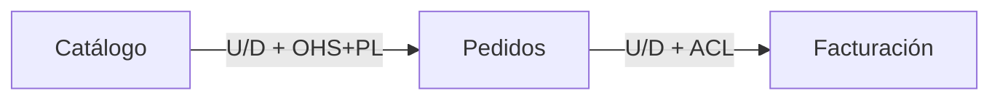
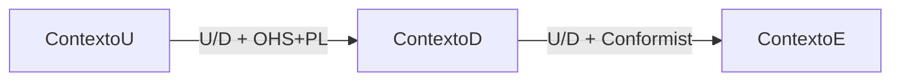
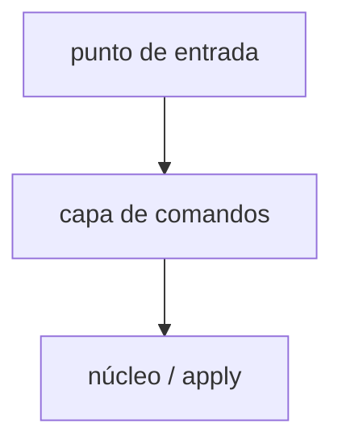

# `<nombre del dominio o producto>` — mapa de dominio

> **Variantes (elige una):**
>
> - **`single`:** solo este archivo como `domain-map.md`. No uses la sección A por separado.
> - **`by-domain` / `by-size`:** este archivo es el **índice** (`domain-map.md`); cuerpos en `domain-map/<dominio-slug>.md` y canvases pesados en `domain-map/bc-<contexto-slug>.md`.
>
> Orden tras el `#`: **`Contexto y alcance`** → **`Lectura rápida`** → resto.
>
> **Contrato del conjunto:** `mapState`, navegación, subdominios, canvases (+ interfaz, mensajes tipados, arqueología en Núcleo), ≥2 mapas por perspectiva (tabla 2 capas + Mermaid U→D; matriz si ≥5 BCs), ≥2 historias, bloques estructurales ≠ C4, polisemia, trazabilidad, decisiones, preguntas de estudio, evaluación. Documento **final**, **autocontenido**, preferir **AS_IS**.

### Checklist de secciones mínimas

- [ ] Contexto y alcance (`mapState`, fuentes, fuera de alcance)
- [ ] Lectura rápida + Guía de estudio
- [ ] Subdominios + criterios
- [ ] Catálogo BC (Núcleo completo / Soporte ficha)
- [ ] ≥2 mapas por perspectiva (leyenda + tabla 2 capas + Mermaid)
- [ ] ≥2 historias (feliz + fallo/umbral)
- [ ] Bloques estructurales ligeros
- [ ] Polisemia / trazabilidad / decisiones / preguntas de estudio / supuestos
- [ ] Evaluación de salida + un `Listo para`

---

# A — Índice (`domain-map.md`) cuando hay división

*En `single`, omite A: usa B en el mismo archivo.*

## Contexto y alcance

- **mapState:** `AS_IS` \| `TO_BE`
- Producto/áreas; fuentes; `splitMode`; qué queda fuera.

## Lectura rápida

- Dominio en una frase.
- Contextos / mapas clave.
- Relación más sensible (tipo + roles).
- Pendientes.

## Guía de estudio

1. **Pasada 1 (~5 min)**: Lectura rápida + historias + 1 mapa runtime
   - Objetivo: Entender el flujo
2. **Pasada 2 (~20 min)**: Subdominios + BCs Núcleo (+ arqueología)
   - Objetivo: Límites y código de entrada
3. **Pasada 3 (~40 min)**: Resto de mapas, bloques, polisemia, evaluación
   - Objetivo: Cuestionar fronteras

## Índice de partes

- [`domain-map/<dominio-slug>.md`](./domain-map/<dominio-slug>.md)
  - Alcance: Dominio …
  - Contenido principal: …

## Visión global

*Una frase del ecosistema y por qué se partió el archivo.*

## Mapas de contexto globales (por perspectiva)

### Pregunta 1 — `<…>` (perspectiva: `<runtime|modelo|semántica|planificación|ownership>`)

#### Leyenda aplicada

*Solo tipos (capa 1) y roles (capa 2) usados en este mapa.*

#### Relaciones (2 capas)

- **Upstream (U)**
- **Downstream (D)**
- **Tipo (capa 1)**: UpstreamDownstream / CustomerSupplier / Partnership / SharedKernel / SeparateWays / BigBallOfMud
- **Roles U / D (capa 2)**: p. ej. OHS+PL / ACL
- **Qué fluye (tipo)**: comando / consulta / evento / documento/archivo / modelo
- **Por qué (negocio)**
- **Riesgo**

#### Matriz U×D (si ≥5 BCs)

- **BC-A** → BC-A: —; BC-B: ; BC-C:
- **BC-B** → BC-A: ; BC-B: —; BC-C:
- **BC-C** → BC-A: ; BC-B: ; BC-C: —

*Celdas: tipo + roles abreviados, o vacío.*

#### Diagrama (Mermaid — flecha U→D)

### Pregunta 2 — `<…>` (perspectiva: `<…>`)

*(Misma subestructura.)*

## Historias de dominio (comportamiento en ejecución)

### Historia 1 — `<nombre>` (camino feliz)

1. `<Actor>` → `<acción>` → `<artefacto>`
2. …

### Historia 2 — `<nombre>` (error / umbral)

1. …

## Bloques estructurales ligeros (estático)

> Solo puntos de entrada → módulos (máx. 2 niveles) para arqueología. **No es C4 ni context map.**

## Polisemia cruzada / Trazabilidad / Decisiones / Preguntas de estudio / Supuestos

*(Tablas estándar; ver sección B.)*

## Evaluación de salida

*(Ver bloque al final de B; en división vive en el índice.)*

---

# B — Mapa completo (`single`) o cuerpo `domain-map/<dominio-slug>.md`

*Si es parte: enlace a [`../domain-map.md`](../domain-map.md). Lectura rápida larga solo en índice/`single`.*

## Contexto y alcance

- **mapState:** `AS_IS` \| `TO_BE`

## Lectura rápida

*(Obligatoria en `single`.)*

## Guía de estudio

1. **Pasada 1**: Lectura rápida + historias + mapa runtime
   - Objetivo: Flujo
2. **Pasada 2**: Subdominios + BCs Núcleo
   - Objetivo: Límites + arqueología
3. **Pasada 3**: Mapas restantes, bloques, polisemia, evaluación
   - Objetivo: Estudio profundo

## Visión del dominio

## Subdominios (espacio de problema)

| Subdominio | Tipo | Problema que cubre | Evidencia | Notas / tensiones |
| --- | --- | --- | --- | --- |
| | Núcleo (Core) / Soporte (Supporting) / Genérico (Generic) | | | |

### Criterios de clasificación usados

## Catálogo de bounded contexts

### Canvas — `<Nombre>` (Núcleo: completo)

- **Propósito**: *(lenguaje de negocio; sin detalle técnico)*
- **Clasificación estratégica**: Núcleo (Core) / Soporte (Supporting) / Genérico (Generic)
- **Evolución (opcional)**: genesis / custom / product / commodity — solo si aporta
- **Subdominio(s)**
- **Límites — dentro**
- **Límites — fuera**
- **Roles de dominio**: p. ej. ejecución, análisis, cumplimiento…
- **Interfaz pública**: Qué pueden consumir/acoplar otros contextos (contratos estables)
- **Ownership tentativo**
- **Archivo dedicado**: *en este archivo* o enlace `bc-*.md`

#### Lenguaje ubicuo

| Término | Definición en este contexto | Anti-términos |
| ---------| -----------------------------| ---------------|
|         |                             |               |

#### Comunicación de entrada / salida

- **Entrada (inbound)**
  - Contraparte
  - Tipo de mensaje: comando / consulta / evento / documento/archivo
  - Qué fluye
  - Relación (tipo + roles)
  - Contrato / notas
- **Salida (outbound)**
  - Contraparte
  - Tipo de mensaje: comando / consulta / evento / documento/archivo
  - Qué fluye
  - Relación (tipo + roles)
  - Contrato / notas

#### Reglas de negocio en el límite

- …

#### Arqueología de código

- **Entrar por**: Símbolo / archivo de entrada
- **Leer después**: 1–3 archivos en orden
- **Fósil / trampa**: Nombre engañoso, layout muerto, indicador sutil
- **Ancla de contrato**: Prueba, schema, id de manifest, etc.

#### Evidencia y supuestos

- **Evidencia:** …
- **Supuestos:** …
- **Preguntas abiertas:** …

### Ficha — `<Nombre>` (Soporte / Genérico: corta)

- **Propósito**
- **Dentro / fuera**
- **Interfaz pública (1 línea)**
- **Arqueología (1 línea)**: Entrar por …

---

## Mapas de contexto (por perspectiva)

> Varios mapas **pequeños**. No un diagrama «dios». Perspectivas distintas del catálogo de la skill.

### Pregunta — `<texto>` (perspectiva: `<…>`)

#### Leyenda aplicada

#### Relaciones (2 capas)

- **Upstream (U)**
- **Downstream (D)**
- **Tipo (capa 1)**
- **Roles U / D (capa 2)**
- **Qué fluye (tipo)**
- **Por qué (negocio)**
- **Riesgo**

#### Matriz U×D (si ≥5 BCs)

- **↓ U \\ D →**: …

#### Diagrama

---

## Historias de dominio (comportamiento en ejecución)

> *Process walkthrough* — no sustituye EventStorming de taller.

### Historia — `<título>`

1. Actor → acción → artefacto
2. …

---

## Bloques estructurales ligeros

> **No es C4 ni context map** — solo anclas de lectura de código.

| Bloque | Responsabilidad | Rutas típicas |
| --- | --- | --- |
| | | |

---

## Polisemia y glosario cruzado

| Término | Contexto A | Contexto B | Riesgo / mitigación |
| --- | --- | --- | --- |
| | | | |

## Trazabilidad subdominio ↔ bounded context

| Subdominio | Bounded context(s) | Notas |
| --- | --- | --- |
| | | |

## Decisiones de frontera

| Decisión | Alternativa descartada | Motivo |
| --- | --- | --- |
| | | |

## Preguntas de estudio (el mapa debe permitir responderlas)

1. …
2. …
3. …

## Supuestos y preguntas abiertas

- …

## Evaluación de salida

> **`Listo para`** usa literales ES de esta skill (`fusionar-solo-detalles` \| `mejorar` \| `bloqueado`); no traducir. Equivalente conceptual a Ready for del workflow review; aquí no es veredicto de PR.

| Criterio | Puntuación (1–10) | Evidencia en este documento |
| --- | --- | --- |
| Navegación / estudio | | |
| Subdominios | | |
| Canvases + arqueología | | |
| Mapas de contexto | | |
| Ejecución + bloques | | |
| Lenguaje / polisemia | | |
| Autocontención | | |
| **Global** | | promedio |

**Listo para:** `mejorar` \| `fusionar-solo-detalles` \| `bloqueado`

**Huecos si no es `fusionar-solo-detalles`:**

- …

---

# C — Parte `domain-map/bc-<contexto-slug>.md`

Enlaces: dominio [`./<dominio-slug>.md`](./<dominio-slug>.md) · índice [`../domain-map.md`](../domain-map.md).

## Canvas — `<Nombre>`

*(Misma estructura Núcleo de la sección B: interfaz pública, mensajes tipados, arqueología.)*
