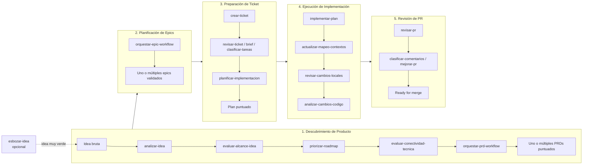

# Factory

Biblioteca de **agent skills** que, una vez integrados a un proyecto real, operan como una **software factory** end-to-end: automatizan el flujo completo de producto a código, desde una idea bruta hasta el merge de un PR.

Los skills son unidades modulares e independientes (cada una con su `SKILL.md`, referencias y assets) que se encadenan mediante orquestadores y gates de calidad para cubrir el proceso:

Idea → PRD → Epic → Ticket → Implementación → PR → Merge

> Nota: `factory` es la **biblioteca de skills**. No es un producto final ni un runtime por sí mismo: se integra dentro de un repositorio real (junto con su `AGENTS.md`, código y comandos de validación) y los skills operan sobre ese codebase y esa documentación.

## Tabla de Contenidos

- [Cómo está organizado](#cómo-está-organizado)
- [Integración en un proyecto real](#integración-en-un-proyecto-real)
- [El proceso end-to-end](#el-proceso-end-to-end)
- [Orquestadores](#orquestadores)
- [Gates de calidad](#gates-de-calidad)
- [Catálogo de skills](#catálogo-de-skills)
- [Documentación](#documentación)
- [Filosofía de diseño](#filosofía-de-diseño)
- [Licencia](#licencia)

## Cómo está organizado

```text
factory/
├── README.md
├── docs/
│   ├── workflows.md          # Mapa de ruta del proceso e2e (entrada/salida/ready-for de cada workflow)
│   └── skills-catalog.md     # Índice de referencia de los 52 skills (rol + artefacto de salida)
└── .agents/                  # Raíz de la biblioteca de skills
    └── skills/
        ├── _shared/          # Rubrics, plantillas y referencias transversales
        ├── <skill>/          # 52 skills, cada uno con SKILL.md + references/ + assets/ (+ scripts/ en algunos)
        └── orquestar-*/      # Orquestadores que encadenan workflows completos
```

Cada skill es un directorio con:

- `SKILL.md` — frontmatter (`name`, `description`, `argument-hint`, `allowed-tools`, `triggers`) + instrucciones de ejecución por fases.
- `references/` y `assets/` — material de apoyo específico del skill (rubrics, plantillas, ejemplos).
- `scripts/` (opcional) — utilidades ejecutables propias del skill (ej. `crear-ticket/scripts/generate-slug.sh`, `revisar-cambios-locales/scripts/load-diff.sh`, `predecir-impacto-cambio/scripts/scan-dependencies.sh`, `detectar-documentacion-faltante/scripts/scan-todos.sh`).

Las rutas de artefactos siguen la convención `docs/<domain>/...` dentro del proyecto integrado.

## Integración en un proyecto real

`factory` está pensado para integrarse dentro de un repositorio de producto existente. El flujo típico:

1. **Copiar o versionar** `.agents/` (y `docs/`) dentro del repo destino, o consumirlo como dependencia según el mecanismo que use tu agente (Devin, Claude, etc.).
2. **Mantener un `AGENTS.md`** en la raíz del proyecto con los comandos de validación (`lint`, `typecheck`, `test`) y convenciones del codebase. Los skills los consumen en las fases de verificación.
3. **Operar el proceso** invocando skills individuales o, preferentemente, los orquestadores (`orquestar-prd-workflow`, `orquestar-epic-workflow`, `implementar-ticket`).
4. Los artefactos se escriben bajo `docs/<domain>/...` siguiendo la convención documentada en [`docs/workflows.md`](docs/workflows.md) y `.agents/skills/_shared/workflow-catalog.md`.

## El proceso end-to-end



- **1. Descubrimiento de Producto**
  - Entrada: Idea bruta (o esbozo de `esbozar-idea`)
  - Artefacto de salida: `prd.md` (uno o varios) + `prd-workflow-summary.md` + `prd-roadmap-state.md` + `roadmap.md`
  - Ready for: `planificar-epics`
- **2. Gestión de Epics**
  - Entrada: PRD
  - Artefacto de salida: `tasks.md` por epic + validación completa
  - Ready for: `crear-ticket`
- **3. Preparación de Ticket**
  - Entrada: Epic-tasks o brief
  - Artefacto de salida: `implementation-plan.md` puntuado
  - Ready for: `implement`
- **4. Ejecución de Implementación**
  - Entrada: Plan puntuado
  - Artefacto de salida: Cambios locales verificados + `code-analysis-summary.md`
  - Ready for: Abrir PR
- **5. Revisión de PRs**
  - Entrada: PR abierto
  - Artefacto de salida: `pr-<N>-review.md` + comentarios postables
  - Ready for: `merge`
- **6. Implementación E2E** (orquestador)
  - Entrada: Ticket sin plan previo
  - Artefacto de salida: Código verificado localmente (orquesta 3 + parte de 4)
  - Ready for: Abrir PR (opcional)

Detalle completo de cada workflow, gates y ramas opcionales (spike, demo, quiz de comprensión, diseño de experimentos) en [`docs/workflows.md`](docs/workflows.md).

> **Paso previo opcional**: si la idea está muy verde o vaga para entrar al Workflow 1, `esbozar-idea` conduce un chat interactivo que la pule en un esbozo ligero (`docs/drafts/<slug>/esbozo.md`) listo para `analizar-idea`. No evalúa viabilidad ni añade detalle — solo formula el resultado deseado sin soluciónizar. Es un paso previo al flujo 1, no parte del orquestador.

## Orquestadores

Automatizan workflows completos cuando no se quiere invocar cada skill a mano:

- **`orquestar-prd-workflow`** — Workflow 1 completo (incluye `analizar-idea`, `evaluar-alcance-idea`, `priorizar-roadmap` y `evaluar-conectividad-tecnica` como gates iniciales).
- **`orquestar-epic-workflow`** — Workflow 2 completo (priorización de epics, conectividad por epic, gates Go/No-Go, rama opcional de spike técnico, loop para múltiples epics).
- **`implementar-ticket`** — Workflow 6: orquesta el Workflow 3 completo más la fase de codificación y verificación del Workflow 4. **No reemplaza al Workflow 4 completo**: no encadena automáticamente `actualizar-mapeo-contextos`, `revisar-cambios-locales` ni `revisar-cambios-implementados` tras la verificación.
- **Módulo transversal Comprensión y Enseñanza** (`explicar-cambio` → `ejecutar-quiz-comprension`) — puerta de calidad insertable antes del Workflow 4 o del Workflow 5.

## Gates de calidad

El proceso está protegido por gates explícitos que detienen o desvían el flujo:

- `validar-viabilidad-producto` — Go/No-Go de producto antes de invertir en PRD (WF1).
- `revisar-ticket` — calidad de tickets (WF3).
- `clasificar-tareas` — triage que decide entre resolver preguntas, spike, demo o planificar (WF3).
- `validar-tarea-trivial` — determina pipeline apropiado (WF5).
- `revisar-cambios-locales` — antes de crear PR (WF4).
- `revisar-pr` — calidad de PRs (WF5).

Más gates embebidos en los orquestadores: no-solutionización en `capturar-requerimiento`, spike por feasibility assumption en WF1, métrica medible por success metric, no-duplicación de condiciones / Go-No-Go, y gates de Go/No-Go por epic en WF2.

## Catálogo de skills

Los 52 skills están agrupados por rol dentro del proceso (Descubrimiento de Producto, Gestión de Epics, Preparación de Ticket, Ejecución de Implementación, Revisión de PRs, Transversal/Standalone), con su artefacto de salida típico.

→ Ver el catálogo completo en [`docs/skills-catalog.md`](docs/skills-catalog.md).

## Documentación

- [`docs/workflows.md`](docs/workflows.md) — Mapa de ruta completo del proceso e2e: descripción narrativa, diagramas Mermaid, gates, ramas opcionales y límites de alcance por workflow.
- [`docs/skills-catalog.md`](docs/skills-catalog.md) — Índice de referencia de los 52 skills (rol + artefacto de salida por workflow).
- `.agents/skills/_shared/workflow-catalog.md` — Índice compartido de skills, rutas de artefactos y orden de llamada típico.
- `.agents/skills/_shared/` — Rubrics y plantillas transversales (`context-brief-rubric.md`, `plan-implementation-rubric.md`, `ticket-review-rubric.md`, `david-bland-framework.md`, `zombie-methodology.md`, etc.).

## Filosofía de diseño

- **Modularidad**: cada skill es independiente y reusable; los workflows permiten entrada/salida en diferentes puntos según el estado del trabajo.
- **Gates explícitos**: el progreso está protegido por veredictos `Ready for` (`blocked` / `refine` / `spike` / `demo` / `planificar-implementacion` / `implement` / `merge` / etc.) que detienen o desvían el flujo en lugar de avanzar a ciegas.
- **Trazabilidad**: cada paso deja un artefacto durable bajo `docs/<domain>/...`; las omisiones se registran explícitamente (stub con razón) para no perder la cadena de decisiones.
- **Outcome-driven**: el descubrimiento parte del resultado deseado, no de la solución; las decisiones de diseño se toman informadas por personas y casos de uso, no antes.
- **Profile-aware**: `lite` (dogfooding / internal / greenfield / MVP N=1) reduce ceremonia vía shortcuts (stub RICE N=1, connectivity short-form, experiment-design omitido); `full` aplica el proceso completo para producto externo / Growth-Scale.

## Licencia

Este proyecto está licenciado bajo la **Licencia MIT**. Consulta el archivo [`LICENSE`](LICENSE) para el texto completo.
