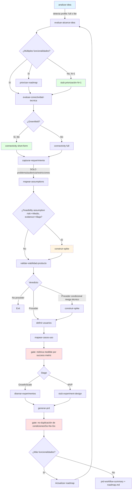

# Plan de Mejora: Workflow 1 (Descubrimiento de Producto) y Handoff → Workflow 2

- **Fecha**: 2026-08-02
- **Scope**: Repositorio `alejandria` (skills + workflows). No modifica `teleprompter`.
- **Caso de estudio**: Ejecución completa del Workflow 1 sobre la idea `teleprompter-cli` (13 artefactos generados en `teleprompter/docs/`).
- **Estado**: Plan — no implementado aún.

---

## 1. Contexto: qué se evaluó

### 1.1 El Workflow 1 (definición)

Workflow 1 (`docs/workflows.md` líneas 102-183) transforma una idea bruta en uno o múltiples PRDs. Cadena 11 skills:

```
analizar-idea → evaluar-alcance-idea → priorizar-roadmap → evaluar-conectividad-tecnica
→ capturar-requerimiento → mapear-assumptions → validar-viabilidad-producto
→ definir-usuarios → mapear-casos-uso → disenar-experimentos (condicional) → generar-prd
```

Orquestado por `orquestar-prd-workflow` (955 líneas). Incluye gates de go/no-go, loop para múltiples funcionalidades, ramas opcionales (división de alcance, features puente, spike, demo) y reconstrucción de estado tras interrupción.

### 1.2 El caso de estudio (teleprompter-cli)

Idea: CLI de Node (`npx @nucleoabierto/teleprompter`) que instala paquetes de configuración de agente IA en un repo destino. MVP dogfooding-first (el repo se instala a sí mismo). Greenfield, 1-2 personas, stage MVP.

Artefactos generados (13 + 3 personas canónicas):

```
idea/teleprompter-cli/
  idea-analysis.md              — analizar-idea (Proceder, 87.5%)
  scope-roadmap.md              — evaluar-alcance-idea (funcionalidad única, 6 fases)
  feature-prioritization.md     — priorizar-roadmap (RICE 3.73, Rank #1 de 1)
  prd-roadmap-state.md          — estado final del roadmap

initiatives/teleprompter-cli/
  connectivity/prerequisites-assessment.md  — evaluar-conectividad-tecnica (greenfield)
  requirements.md               — capturar-requerimiento
  assumption-map.md             — mapear-assumptions (16 assumptions, A1-A16)
  product-viability.md          — validar-viabilidad-producto (Conditional Go, 75%)
  personas-mapping.md           — definir-usuarios (Gil, Sam, Riley)
  use-cases.md                  — mapear-casos-uso (6 UC)
  experiment-design.md          — disenar-experimentos (stub — omitido por MVP)
  prd.md                        — generar-prd (PRD formal, 12 secciones)
  prd-workflow-summary.md       — orquestador (resumen consolidado)

personas/
  gil.md, sam.md, riley.md      — personas canónicas

roadmap.md                      — roadmap consolidado del dominio
```

### 1.3 El primer paso del Workflow 2 (`planificar-epics`)

WF2 empieza con `planificar-epics`, que lee el PRD y genera una estructura de 3-7 epics. Su Fase A valida: objetivo, usuario, criterios de éxito, restricciones, alcance, y `Ready for: planificar-epics`. Su Fase B analiza el codebase (grep por arquitecturas existentes, deuda técnica, precedentes). Su Fase C estructura epics con regla "cada epic deployable de forma independiente".

---

## 2. Hallazgos: qué funciona y qué no

### 2.1 Lo que funciona bien (preservar)

- **Trazabilidad de assumptions**: A1-A16 viajan sin mutación por `assumption-map` → `product-viability` (matriz de riesgo) → `experiment-design` (stub) → `prd.md` (sección 6 + 11) → `roadmap.md` (riesgos residuales). El veredicto "Conditional Go 75%" y las 3 condiciones heredadas se repiten consistentes en 4 documentos.
- **Handoff entre skills**: `analizar-idea` emite "Fase F — Observaciones de diseño" que enumera exactamente las preguntas que `evaluar-alcance-idea` debe resolver. Ese patrón de handoff está bien diseñado.
- **Omisiones registradas**: stage MVP → stub de `disenar-experimentos` con veredicto "Omitido por stage MVP". Greenfield → `evaluar-conectividad-tecnica` genera artefacto obligatorio en vez de saltarse. El orquestador respetó "no se salta, se registra".
- **Arquitectura de personas en dos capas**: canónicas en `personas/` + mapeo por PRD en `personas-mapping.md`. Evita duplicación entre iniciativas del mismo dominio.
- **Calidad del PRD**: 12 secciones, RF/RNF accionables, errores numerados (E1-E7), Out of Scope explícito. Directamente implementable.

### 2.2 Problemas estructurales del Workflow 1

| #  | Problema                                                                                                                                                                                                                                                                                                                                                                                                                           | Evidencia en el caso de estudio                                                                                                                                                                                                                          |
|----|------------------------------------------------------------------------------------------------------------------------------------------------------------------------------------------------------------------------------------------------------------------------------------------------------------------------------------------------------------------------------------------------------------------------------------|----------------------------------------------------------------------------------------------------------------------------------------------------------------------------------------------------------------------------------------------------------|
| P1 | **Cristalización prematura de solución**: `capturar-requerimiento` permite "Decisiones resueltas" de detalle de diseño (formato de manifiesto, flags, política de colisiones) antes de personas y casos de uso.                                                                                                                                                                                                                    | `scope-roadmap.md` ya fija `teleprompter.yml`, prompt overwrite/skip/abort, handoff dual stdout+archivo. `requirements.md` los copia. El PRD los copia de nuevo en RF-1..RF-7. Las personas y UC no informan la solución — la solución ya estaba fijada. |
| P2 | **Spike de feasibility no dispara por assumption**: `construir-spike` solo se invoca si `validar-viabilidad-producto` da "Proceder condicional **por riesgo técnico**". Aquí el conditional fue por **demanda**, así que el spike formal no disparó. A10 (handoff consumible por agentes, feasibility, medium risk / low evidence) quedó como "condición heredada = primera fase de implementación" en vez de spike antes del PRD. | `assumption-map.md` marca A10 como Priority 1. `product-viability.md` lo lista como riesgo técnico pero no dispara spike porque el veredicto general es por demanda. El PRD incluye el handoff (Fase 4) como parte del MVP sin de-riskear.               |
| P3 | **Ceremonia desproporcionada para dogfooding**: el workflow trata un MVP interno dogfooding como una iniciativa Growth. RICE sobre N=1, conectividad greenfield 90% N/A, 3 personas para 1-2 devs.                                                                                                                                                                                                                                 | `feature-prioritization.md` admite "priorización trivial (un solo item)". `prerequisites-assessment.md` es 90% filas "No existe / No aplica (greenfield)".                                                                                               |
| P4 | **Métricas no medibles**: `mapear-casos-uso` produce success metrics con thresholds numéricos firmes sin verificar si hay plan de medición. El PRD admite "No telemetría automática en MVP".                                                                                                                                                                                                                                       | "0 customizaciones perdidas" (¿auto-reporte?), "Time-to-onboard < 5 min" (¿quién cronometra?), "> 60% adopción" (¿denominador?).                                                                                                                         |
| P5 | **Duplicación de contenido entre artefactos**: Go/No-Go, condiciones heredadas y criterios experimentales se reescriben en `product-viability.md` §7, `experiment-design.md`, `prd.md` §6, y `prd-workflow-summary.md`.                                                                                                                                                                                                            | Los mismos 4 criterios Go/No-Go aparecen idénticos en 4 documentos.                                                                                                                                                                                      |
| P6 | **Orquestador excesivamente largo**: 955 líneas. La Fase 0.5 (reconstrucción de estado, ~80 líneas) no se ejercitó (no hay `workflow-state.md` en teleprompter). Riesgo de que el modelo no siga todo el prompt.                                                                                                                                                                                                                   | `find teleprompter/docs -name "workflow-state.md"` → vacío.                                                                                                                                                                                              |

### 2.3 Problemas del handoff WF1 → WF2

| #  | Problema                                                                                                                                                                                                                  | Evidencia                                                                                                                          |
|----|---------------------------------------------------------------------------------------------------------------------------------------------------------------------------------------------------------------------------|------------------------------------------------------------------------------------------------------------------------------------|
| H1 | **`planificar-epics` rehace análisis de codebase que `evaluar-conectividad-tecnica` ya hizo**. Fase B hace grep por arquitecturas existentes; para greenfield no hay nada que greppear.                                   | `prerequisites-assessment.md` ya dice "greenfield, sin codebase". `planificar-epics` no lo referencia.                             |
| H2 | **`planificar-epics` asume 3-7 epics, pero WF1 puede producir PRDs de funcionalidad única**. El caso de estudio es una feature cohesiva con 6 fases internas lineales.                                                    | `scope-roadmap.md` dice "funcionalidad única, no se divide en PRDs separados". `planificar-epics` Fase C dice "3-7 epics".         |
| H3 | **Regla "deployable de forma independiente" choca con features inherentemente secuenciales**. Las 6 fases del PRD tienen dependencia lineal (manifiesto → copia → colisiones → handoff → distribución → auto-referencia). | `planificar-epics` Fase C: "Cada epic debe ser deployable de forma independiente". El PRD sección 9 muestra dependencias lineales. |
| H4 | **`planificar-epics` no consume el veredicto condicional ni las condiciones heredadas**. Fase A solo chequea `Ready for: planificar-epics`, no "Conditional Go" ni condiciones pendientes.                                | PRD dice "Conditional Go (75%) con 3 condiciones heredadas". `planificar-epics` Fase A no pregunta por condiciones.                |
| H5 | **El PRD pre-especifica el timeline de implementación (6 fases con dependencias)**, haciendo el trabajo de `planificar-epics`.                                                                                            | PRD sección 9 (Timeline) ya descompone en fases con duraciones y dependencias. `planificar-epics` tendría poco que añadir.         |
| H6 | **Path inconsistency**: `planificar-epics` skill escribe en `docs/<domain>/<PRD-SLUG>-epic-plan.md` (plano); el workflow doc y el catálogo esperan `docs/<domain>/initiatives/<PRD-SLUG>/epics/epic-plan.md` (anidado).   | `planificar-epics/SKILL.md` línea 87 vs `workflows.md` línea 242 vs `_shared/workflow-catalog.md` línea 151.                       |

### 2.4 Veredicto del handoff

El handoff WF1→WF2 es **formalmente correcto** (el PRD tiene `Ready for: planificar-epics` y todos los campos que `planificar-epics` Fase A valida), pero **estructuralmente friccionado**: el PRD sobre-especifica la implementación (H5), `planificar-epics` rehace trabajo (H1), asume multiplicity de epics (H2), y no consume el veredicto condicional (H4). El resultado es que `planificar-epics` tendría poco valor añadido sobre el PRD tal como está, o produciría artefactos forzados (3-7 epics artificiales sobre una feature cohesiva).

---

## 3. Plan de mejora

### Visión general

El plan se organiza en 4 áreas:

- **A. Gates de calidad de razonamiento** — nuevos gates que frenan problemas detectados (P1, P2, P4).
- **B. Path lite para dogfooding/internal** — reducir ceremonia para MVPs internos (P3).
- **C. DRY y consistencia** — eliminar duplicación y fijar paths (P5, P6, H6).
- **D. Handoff WF1→WF2** — alinear el output de WF1 con el input de WF2 (H1-H5).

Cambio estructural mayor: **separar la definición de solución del captura de requerimiento**, moviendo las decisiones de diseño a una posición posterior del flujo donde personas y casos de uso ya informan la solución.

### Diagrama del flujo propuesto



Cambios vs flujo actual (en azul/amarillo/rojo):

- **Nuevo**: gate de spike por feasibility assumption (I2→I3) — frena P2.
- **Nuevo**: gate de métrica medible (N2) — frena P4.
- **Nuevo**: gate de no-duplicación en PRD (R2) — frena P5.
- **Nuevo**: stub de priorización N=1 (D2) — frena P3.
- **Nuevo**: connectivity short-form greenfield (G2) — frena P3.
- **Modificado**: `capturar-requerimiento` ahora solo problema/audiencia/restricciones (no diseño de solución) — frena P1.
- **Modificado**: `generar-prd` no incluye timeline de fases de implementación (eso es job de `planificar-epics`) — frena H5.

---

### A. Gates de calidad de razonamiento

#### A1. Gate de "no-solutionización" en `capturar-requerimiento`

**Problema**: P1 — el requirements.md contiene "Decisiones resueltas" de detalle de diseño (formato de manifiesto, flags, política de colisiones) antes de que personas y casos de uso informen la solución.

**Cambio en `capturar-requerimiento/SKILL.md`**:

- Renombrar la sección "Decisiones resueltas" a "Restricciones y decisiones de alcance".
- Añadir regla explícita: **las decisiones resueltas pueden ser solo de tipo (a) restricciones de timing/recursos/negocio, (b) restricciones de tech stack impuestas externamente, (c) decisiones de alcance (qué queda fuera del MVP)**. **NO pueden ser decisiones de diseño de solución** (formato de archivos, flags, políticas de UX, mecanismos de handoff).
- Añadir autoevaluación: `[ ] Ninguna "decisión resuelta" es de detalle de diseño de solución — si lo es, mover al PRD o a un ADR`.
- Las decisiones de diseño de solución se toman en `generar-prd` (RF section), informadas por personas + UC.

**Impacto en artefactos existentes**: el `requirements.md` de teleprompter tendría que mover 5 de sus 7 "Decisiones resueltas" (manifiesto, rutas destino, colisiones, handoff, distribución, auto-referencia) fuera. Solo quedarían "Stack: Node ≥ 18 LTS + TypeScript" (restricción) y "MVP se prueba localmente primero" (decisión de alcance).

#### A2. Gate de spike por feasibility assumption

**Problema**: P2 — `construir-spike` solo dispara si `validar-viabilidad-producto` da "Proceder condicional por riesgo técnico". Assumptions de feasibility con risk≥Medio y evidence≤Baja quedan enterrados.

**Cambio en `orquestar-prd-workflow/SKILL.md`** (nueva Fase D.5.5, entre `mapear-assumptions` y `validar-viabilidad-producto`):

```
Fase D.5.5 — Gate de spike por feasibility assumption

Después de mapear-assumptions, antes de validar-viabilidad-producto:

1. Leer assumption-map.md
2. Filtrar assumptions donde:
   - bucket = feasibility
   - risk ∈ {Alto, Medio}
   - evidence ∈ {Baja, Media}
3. Si hay matches → invocar construir-spike por cada assumption
   - El spike responde la pregunta de feasibility puntual
   - Output: spike-notes.md por assumption
   - Tras el spike, continuar a validar-viabilidad-producto
4. Si no hay matches → continuar directo a validar-viabilidad-producto
5. Registrar la decisión (spike disparado o no) en workflow-state.md
```

**Cambio en `mapear-assumptions/SKILL.md`**: añadir al output un campo `spike-required: yes/no` por assumption priorizado, con la pregunta específica que el spike debe responder.

**Impacto en el caso de estudio**: A10 (handoff consumible por agentes, feasibility, Medio/Baja) habría disparado un spike antes del PRD. El spike habría validado si Devin/Cursor/Claude Code consumen stdout + `.agents/teleprompter-handoff.md` antes de comprometer la Fase 4 en el MVP.

#### A3. Gate de "métrica medible" en `mapear-casos-uso`

**Problema**: P4 — success metrics con thresholds numéricos firmes sin plan de medición.

**Cambio en `mapear-casos-uso/SKILL.md`**:

- Cada success metric debe declarar un campo `measurement` con valores: `telemetría | survey | auto-reporte | manual | no-medible-en-MVP`.
- Si `measurement ∈ {survey, auto-reporte, manual}` → el threshold debe ser cualitativo ("Gil reporta 0 pérdidas en 2 semanas de uso"), no numérico firme ("0 customizaciones perdidas").
- Si `measurement = no-medible-en-MVP` → la métrica se marca como "observación post-MVP" y no cuenta para Go/No-Go.
- Añadir autoevaluación: `[ ] Toda success metric tiene campo measurement declarado` y `[ ] Las métricas con measurement manual/survey tienen thresholds cualitativos`.

**Impacto en el caso de estudio**: "0 customizaciones perdidas" → `measurement: auto-reporte` → threshold cualitativo "Gil reporta 0 pérdidas en 2 semanas". "Time-to-onboard < 5 min" → `measurement: manual` → "teammate reporta < 5 min en encuesta post-onboarding".

#### A4. Gate de "no-duplicación" en `generar-prd`

**Problema**: P5 — Go/No-Go, condiciones heredadas y criterios experimentales se reescriben en 4 documentos.

**Cambio en `generar-prd/SKILL.md`**:

- Sección 6 (Requisitos Experimentales) → **referenciar** `experiment-design.md` en vez de reescribir los criterios. Incluir solo un resumen de 1-2 líneas + link.
- Sección 11 (Riesgos) → **referenciar** `product-viability.md` §5 (matriz de riesgo) + `assumption-map.md` (assumptions críticos). No reescribir la matriz.
- Condiciones heredadas → **referenciar** `product-viability.md` §7. No reescribir.
- Añadir autoevaluación: `[ ] Secciones 6 y 11 referencian (no duplican) los artefactos upstream`.

---

### B. Path lite para dogfooding/internal

#### B1. Detección de profile en `analizar-idea`

**Problema**: P3 — el workflow trata todo igual, sin distinguir dogfooding/internal de producto externo Growth/Scale.

**Cambio en `analizar-idea/SKILL.md`**:

- Añadir al output un campo `profile` con valores: `full | lite`.
- Criterios para `lite`: dogfooding O internal tool O 1-2 personas O greenfield O stage MVP con N=1 funcionalidad.
- Criterios para `full`: producto externo O stage Growth/Scale O N>1 funcionalidades O requiere validación de demanda externa.

**Cambio en `orquestar-prd-workflow/SKILL.md`**:

- Fase 0 lee el `profile` de `idea-analysis.md`.
- Si `lite` → activa shortcuts: stub RICE (B2), connectivity short-form (B3), 1 persona en vez de 2-3 (B4), experiment-design omitido por defecto.
- Si `full` → flujo completo actual.

#### B2. Short-circuit de RICE cuando N=1

**Problema**: P3 — `feature-prioritization.md` con un solo item es ceremonia pura.

**Cambio en `priorizar-roadmap/SKILL.md`**:

- Si el input `scope-roadmap.md` dice "funcionalidad única" → emitir un stub:

  ```
  # Feature Prioritization: <IDEA-SLUG>
  ## Veredicto: Funcionalidad única — sin priorización
  - Items totales: 1
  - Score RICE registrado como sanity check: <score>
  - Ready for: evaluar-conectividad-tecnica
  ```

- No generar roadmap ranqueado ni tabla de dependencias.
- Añadir autoevaluación: `[ ] Si N=1, se emitió stub (no roadmap ranqueado)`.

#### B3. Connectivity short-form para greenfield

**Problema**: P3 — `prerequisites-assessment.md` es 90% filas "No existe / No aplica".

**Cambio en `evaluar-conectividad-tecnica/SKILL.md`**:

- Si el repo es greenfield (sin `src/`, sin `package.json` de producto, sin infraestructura de producto) → emitir short-form:

  ```
  # Prerequisites Assessment: <PRD-SLUG>
  ## Modo: Greenfield
  ## Componentes a crear (tabla de 1 columna)
  | Componente | Notas |
  ## Veredicto: Conectado (greenfield)
  ```

- Skip del escaneo de auth/DB/APIs/servicios/frontend/monitoring (todos N/A).
- Añadir autoevaluación: `[ ] Si greenfield, se emitió short-form`.

#### B4. Personas reducidas para dogfooding

**Problema**: P3 — 3 personas (2 primarias + 1 secundaria) para un MVP de 1-2 devs dogfooding.

**Cambio en `definir-usuarios/SKILL.md`**:

- Si `profile = lite` → 1 persona primaria (el dogfooder) + 0-1 secundaria (solo si hay un rol distinto claro, ej: agent operator).
- Si `profile = full` → 2-3 personas (regla actual).
- Añadir autoevaluación: `[ ] Si profile=lite, se definió 1 primaria (+ 0-1 secundaria)`.

---

### C. DRY y consistencia

#### C1. Extracción de state-reconstruction a recurso referenciado

**Problema**: P6 — 80 líneas de algoritmo inline en el orquestador.

**Cambio en `orquestar-prd-workflow/SKILL.md`**:

- Mover Fase 0.5 (algoritmo de reconstrucción + tabla canónica pasos→artefactos) a `references/state-reconstruction.md`.
- En el SKILL.md, reemplazar con: "Ver `references/state-reconstruction.md` para el algoritmo de reconstrucción de estado. Aplicar el patrón de skip-check descrito allí en cada Fase A-H."
- Reducir el SKILL.md de ~955 a ~700 líneas.

#### C2. Verificación de que `workflow-state.md` se escribe

**Problema**: P6 — no se encontró `workflow-state.md` en el caso de estudio.

**Cambio en `orquestar-prd-workflow/SKILL.md`**:

- Añadir al gate de cierre (Fase J): `[ ] workflow-state.md existe y está actualizado con todos los pasos completados`.
- Si no existe → generarlo retroactivamente desde los artefactos en disco.

#### C3. Fix path inconsistency en `planificar-epics`

**Problema**: H6 — path plano vs anidado.

**Cambio en `planificar-epics/SKILL.md`** y skills downstream (`priorizar-epics`, `evaluar-conectividad-epic`):

- Cambiar `docs/<domain>/<PRD-SLUG>-epic-plan.md` → `docs/<domain>/initiatives/<PRD-SLUG>/epics/epic-plan.md`.
- Alinear con `workflows.md` línea 242 y `_shared/workflow-catalog.md` línea 151.

---

### D. Handoff WF1 → WF2

#### D1. `planificar-epics` consume el artefacto de conectividad de WF1

**Problema**: H1 — rehace análisis de codebase.

**Cambio en `planificar-epics/SKILL.md` Fase B**:

- Paso 0 (nuevo): leer `docs/<domain>/initiatives/<PRD-SLUG>/connectivity/prerequisites-assessment.md` si existe.
- Si greenfield → skip del grep por arquitecturas existentes; usar el assessment como input directo.
- Si no greenfield → usar el assessment como punto de partida, complementar con grep específico del epic.

#### D2. `planificar-epics` maneja PRDs de funcionalidad única

**Problema**: H2 — asume 3-7 epics.

**Cambio en `planificar-epics/SKILL.md` Fase C**:

- Cambiar "3-7 epics" → "1-7 epics".
- Si el PRD es funcionalidad única con fases internas lineales → 1-3 epics alineados a boundaries de value-delivery naturales (no 1 epic por fase interna).
- Criterio de split: agrupar fases que juntas entregan valor verificable. Ej: Fases 1-3 (instalador funcional) = Epic 1; Fase 4 (handoff) = Epic 2; Fases 5-6 (distribución + dogfooding) = Epic 3.

#### D3. Relajar "deployable de forma independiente"

**Problema**: H3 — features secuenciales no pueden ser independientes.

**Cambio en `planificar-epics/SKILL.md` Fase C**:

- Cambiar "Cada epic debe ser deployable de forma independiente" → "Cada epic debe entregar **valor verificable** ( testeable, demostrable). Independencia de deploy es deseable pero no obligatoria para features inherentemente secuenciales."
- Añadir nota: "Si los epics tienen dependencia lineal fuerte, documentar el orden y marcar `sequential`."

#### D4. `planificar-epics` consume el veredicto condicional

**Problema**: H4 — no consume "Conditional Go" ni condiciones pendientes.

**Cambio en `planificar-epics/SKILL.md` Fase A**:

- Añadir validación: leer `product-viability.md` si existe.
- Si veredicto = "Conditional Go" → surfacar las condiciones como riesgos/open questions en el epic plan.
- Mapear cada condición a un epic-level risk o prerequisite. Ej: "Condición: 5+ user interviews valida A1/A2" → "Riesgo del Epic 1: si las interviews revelan que A1/A2 fallan, el epic de distribución (Fase 5) se pausa."
- Añadir autoevaluación: `[ ] Si el PRD tiene Conditional Go, las condiciones se mapearon a riesgos por epic`.

#### D5. PRD no pre-especifica timeline de fases de implementación

**Problema**: H5 — el PRD hace el trabajo de `planificar-epics`.

**Cambio en `generar-prd/SKILL.md`**:

- Sección 9 (Timeline) → reemplazar "Timeline de fases de implementación" con "Restricción de timeline":
  - Solo declarar: "MVP target: ~3-4 semanas", "Buffer: +30%", "Observación post-release: +2 semanas".
  - NO descomponer en fases internas con dependencias — eso es job de `planificar-epics`.
- Si el PRD proviene de un `scope-roadmap.md` con fases internas → referenciarlo: "Ver `scope-roadmap.md` para el desglose interno de fases. La decomposition en epics se realiza en `planificar-epics`."
- Añadir autoevaluación: `[ ] La sección Timeline no descompone en fases de implementación (eso es job de planificar-epics)`.

---

## 4. Resumen de cambios por archivo

| Archivo                                                     | Cambios                                                                                                                                                                                               | Área           |
|-------------------------------------------------------------|-------------------------------------------------------------------------------------------------------------------------------------------------------------------------------------------------------|----------------|
| `capturar-requerimiento/SKILL.md`                           | Gate no-solutionización: "Decisiones resueltas" → solo restricciones/alcance, no diseño de solución                                                                                                   | A1             |
| `mapear-assumptions/SKILL.md`                               | Añadir campo `spike-required` por assumption priorizado                                                                                                                                               | A2             |
| `orquestar-prd-workflow/SKILL.md`                           | Nueva Fase D.5.5 (gate spike por feasibility); extraer Fase 0.5 a `references/state-reconstruction.md`; leer `profile` en Fase 0; activar shortcuts lite; gate de cierre verifica `workflow-state.md` | A2, B1, C1, C2 |
| `mapear-casos-uso/SKILL.md`                                 | Campo `measurement` obligatorio por success metric; thresholds cualitativos si manual/survey                                                                                                          | A3             |
| `generar-prd/SKILL.md`                                      | Secciones 6 y 11 referencian (no duplican) artefactos upstream; sección 9 no descompone en fases de implementación                                                                                    | A4, D5         |
| `analizar-idea/SKILL.md`                                    | Añadir campo `profile: full / lite` al output                                                                                                                                                         | B1             |
| `priorizar-roadmap/SKILL.md`                                | Stub si N=1 (no roadmap ranqueado)                                                                                                                                                                    | B2             |
| `evaluar-conectividad-tecnica/SKILL.md`                     | Short-form si greenfield                                                                                                                                                                              | B3             |
| `definir-usuarios/SKILL.md`                                 | 1 persona (+ 0-1 secundaria) si profile=lite                                                                                                                                                          | B4             |
| `planificar-epics/SKILL.md`                                 | Fase B lee connectivity artefacto; Fase C permite 1-7 epics; relaja "deployable independientemente"; Fase A consume Conditional Go; fix path a `initiatives/<PRD-SLUG>/epics/epic-plan.md`            | D1-D4, C3      |
| `priorizar-epics/SKILL.md`                                  | Fix path input a `initiatives/<PRD-SLUG>/epics/epic-plan.md`                                                                                                                                          | C3             |
| `evaluar-conectividad-epic/SKILL.md`                        | Fix path input a `initiatives/<PRD-SLUG>/epics/epic-plan.md`                                                                                                                                          | C3             |
| `orquestar-epic-workflow/SKILL.md`                          | Fix path esperado a `initiatives/<PRD-SLUG>/epics/epic-plan.md`                                                                                                                                       | C3             |
| `docs/workflows.md`                                         | Actualizar diagrama WF1 (nuevos gates); actualizar narrativa WF1 (profile, gates); actualizar narrativa WF2 paso 1 (consume connectivity, 1-7 epics, Conditional Go)                                  | A, B, D        |
| `orquestar-prd-workflow/references/state-reconstruction.md` | **Nuevo** — algoritmo de reconstrucción extraído                                                                                                                                                      | C1             |

**Total**: 13 archivos modificados + 1 nuevo.

---

## 5. Orden de implementación sugerido

### Fase 1 — Gates críticos (mayor impacto, menor riesgo)

Prioridad alta: frena los problemas estructurales más serios (P1, P2).

1. **A1** — Gate no-solutionización en `capturar-requerimiento`.
2. **A2** — Gate spike por feasibility assumption en `orquestar-prd-workflow` + `mapear-assumptions`.
3. **D5** — PRD no pre-especifica timeline de fases en `generar-prd`.

### Fase 2 — Handoff WF1→WF2

Prioridad alta: sin esto, WF2 arranca con fricción innecesaria.

1. **D1** — `planificar-epics` consume connectivity artefacto.
2. **D2** — `planificar-epics` permite 1-7 epics.
3. **D3** — Relajar "deployable independientemente".
4. **D4** — `planificar-epics` consume Conditional Go.
5. **C3** — Fix path inconsistency (planificar-epics + downstream).

### Fase 3 — Path lite

Prioridad media: reduce ceremonia pero no frena errores.

1. **B1** — Detección de profile en `analizar-idea`.
2. **B2** — Stub RICE N=1 en `priorizar-roadmap`.
3. **B3** — Connectivity short-form en `evaluar-conectividad-tecnica`.
4. **B4** — Personas reducidas en `definir-usuarios`.

### Fase 4 — DRY y consistencia

Prioridad media-baja: limpieza.

 1. **A3** — Gate métrica medible en `mapear-casos-uso`.
 2. **A4** — Gate no-duplicación en `generar-prd`.
 3. **C1** — Extraer state-reconstruction a `references/`.
 4. **C2** — Verificar `workflow-state.md` en gate de cierre.

### Fase 5 — Documentación

 1. Actualizar `docs/workflows.md` con diagrama y narrativa nuevos.

---

## 6. Validación del plan

### 6.1 Cómo verificar que los cambios funcionan

Re-ejecutar el caso de estudio `teleprompter-cli` con los skills modificados y verificar:

| Cambio                  | Verificación esperada                                                                                                                                                                                                   |
|-------------------------|-------------------------------------------------------------------------------------------------------------------------------------------------------------------------------------------------------------------------|
| A1 (no-solutionización) | `requirements.md` no contiene decisiones de diseño de solución (formato manifiesto, flags, handoff). Solo restricciones.                                                                                                |
| A2 (spike feasibility)  | A10 dispara `construir-spike` antes del PRD. `spike-notes.md` existe. El PRD solo incluye el handoff (Fase 4) si el spike valida que los agentes consumen stdout + archivo.                                             |
| A3 (métrica medible)    | `use-cases.md` tiene campo `measurement` por success metric. Los thresholds manuales/survey son cualitativos.                                                                                                           |
| A4 (no-duplicación)     | `prd.md` sección 6 referencia `experiment-design.md` (no reescribe criterios). Sección 11 referencia `product-viability.md` §5.                                                                                         |
| B1-B4 (path lite)       | `idea-analysis.md` tiene `profile: lite`. `feature-prioritization.md` es stub. `prerequisites-assessment.md` es short-form. `personas-mapping.md` tiene 1 primaria (+ Riley secundaria).                                |
| D1-D5 (handoff)         | `planificar-epics` lee `prerequisites-assessment.md` (no rehace grep). Produce 1-3 epics (no 3-7 forzados). Mapea condiciones de Conditional Go a riesgos por epic. PRD no tiene sección 9 con fases de implementación. |
| C3 (paths)              | `planificar-epics` escribe en `initiatives/<PRD-SLUG>/epics/epic-plan.md`.                                                                                                                                              |

### 6.2 Riesgos del plan

- **A1 puede generar resistencia**: mover decisiones de diseño fuera de `capturar-requerimiento` cambia el hábito. Para greenfield dogfooding donde el dogfooder sabe lo que quiere, puede sentirse como burocracia. Mitigación: el gate es una regla de "qué va en este artefacto", no "no puedes decidir" — las decisiones van al PRD, solo más tarde en el flujo.
- **A2 puede alargar el ciclo**: spikes adicionales añaden tiempo. Mitigación: el spike es desechable y corto (1 semana para A10); el costo de NO hacer el spike es comprometer una mecánica no validada en el MVP.
- **B1-B4 pueden perder información**: el path lite reduce artefactos. Mitigación: las omisiones se registran (stub), no se eliminan — la trazabilidad se preserva.
- **D5 puede sentirse como pérdida**: el PRD sin timeline de fases puede parecer menos completo. Mitigación: el timeline de fases vive en `planificar-epics` donde pertenece; el PRD retiene la restricción de timeline ("MVP target: 3-4 semanas").

---

## 7. Notas sobre el Workflow 2 (validación del primer paso)

El primer paso del WF2 (`planificar-epics`) fue evaluado contra el output real del WF1 (PRD de teleprompter-cli). Hallazgos:

- **Formalmente**: el handoff funciona — el PRD tiene `Ready for: planificar-epics` y todos los campos que Fase A valida.
- **Estructuralmente**: 6 fricciones (H1-H6) que reducen el valor añadido de `planificar-epics` sobre el PRD tal como está.
- **Con los cambios D1-D5 + C3**: el handoff se alinea. `planificar-epics` consume el trabajo de WF1 (connectivity, veredicto condicional) en vez de rehacerlo, maneja PRDs de funcionalidad única sin forzar 3-7 epics, y el PRD no le roba el trabajo de decomposition.

**Conclusión**: con los cambios del plan, el output de WF1 es **suficiente y bien alineado** para iniciar WF2. Sin los cambios, el handoff es formalmente correcto pero estructuralmente friccionado — `planificar-epics` tendría poco que añadir o produciría artefactos forzados.
