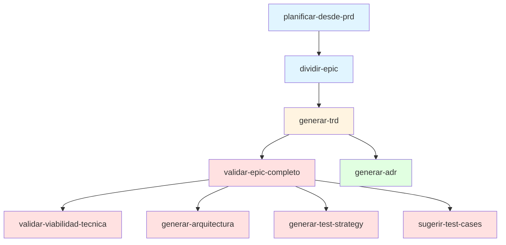
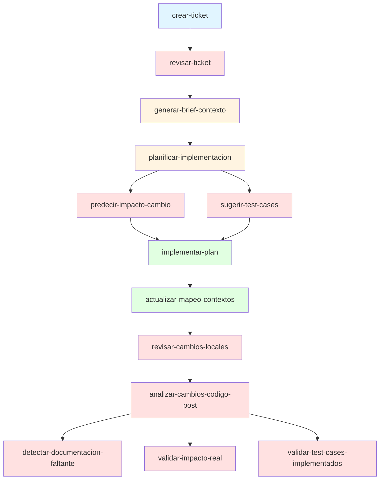
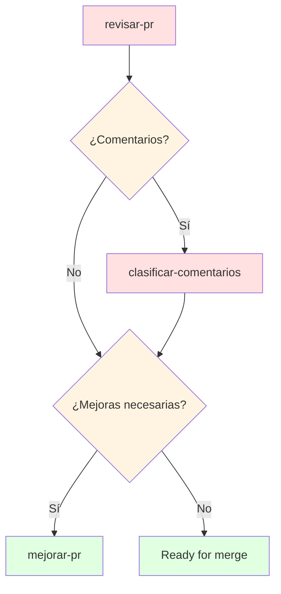
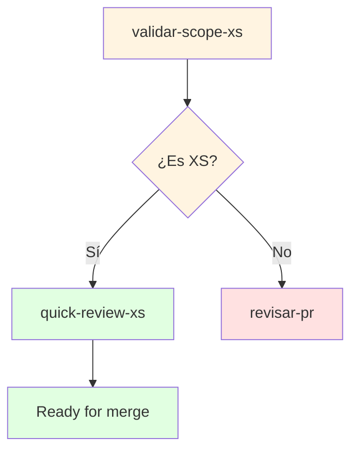
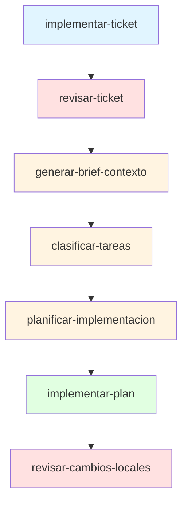
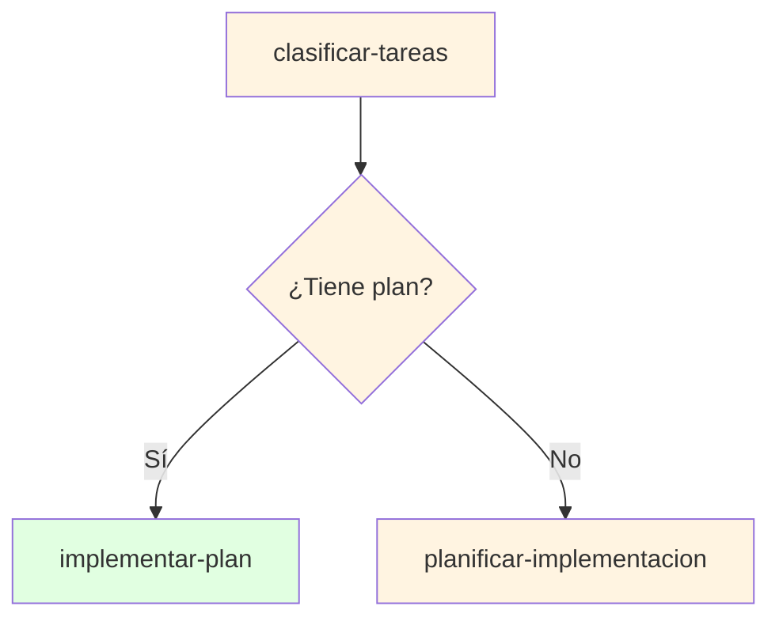
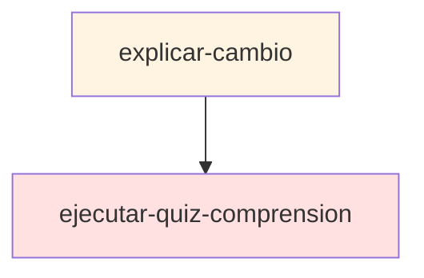

# Workflows de Skills

Este documento describe los workflows interconectados disponibles en la librería de skills del proyecto Alejandria.

## Workflow 1: Gestión de Epics (Planificación Estratégica)

Este workflow transforma un PRD en epics validados con documentación técnica completa.

**Propósito**: Convertir iniciativas de producto (PRDs) en epics estructurados con validación técnica, arquitectura visual, estrategia de testing y decisiones arquitectónicas documentadas.

**Descripción narrativa**: Este workflow comienza con el PRD como punto de entrada, el cual se transforma en una estructura de epics mediante `planificar-desde-prd`.

El skill analiza el PRD (Fase A: validar objetivo, usuarios, criterios de éxito), explora el codebase para detectar deuda técnica y precedentes (Fase B), estructura 3-7 epics con AC, dependencias y estimaciones (Fase C), mapea dependencias entre epics (Fase D) y genera el documento `docs/<domain>/<PRD-SLUG>-epic-plan.md` (Fase E).

Este artefacto pasa a `dividir-epic`, que carga el epic seleccionado y el contexto técnico (Fase A), divide el epic en 5-12 tareas atómicas con AC, archivos que toca y estimaciones 1-8 puntos (Fase B), mapea artefactos del codebase por tarea (Fase C), detecta dependencias entre tareas (Fase D) y genera `docs/<domain>/<EPIC-SLUG>-tasks.md` (Fase F).

Este artefacto alimenta a `generar-trd`, que analiza AC técnicos del epic (Fase A), especifica arquitectura general, modelos de datos, APIs, integraciones y comportamientos críticos (Fases B-E), define testing strategy y riesgos (Fases F-G) y genera `docs/<domain>/<EPIC-SLUG>-trd.md` (Fase H).

El orquestador `validar-epic-completo` toma el plan de tareas y ejecuta en secuencia: `validar-viabilidad-tecnica` (analiza codebase, valida construcciones nuevas vs reutilización, identifica deuda técnica bloqueante, compara con precedentes, detecta brechas de infraestructura, genera `docs/<domain>/<EPIC-SLUG>-viability-assessment.md`), `generar-arquitectura` (analiza TRD para componentes, crea diagramas Mermaid de componentes, flujos y deployment, define matriz de comunicación, escalabilidad, resiliencia, seguridad y monitoreo, genera `docs/<domain>/<EPIC-SLUG>-architecture.md`), `generar-test-strategy` (identifica componentes críticos, aplica metodología ZOMBIE por componente, define matriz de cobertura unit/integration/E2E, especifica test data strategy y validaciones por layer, genera `docs/<domain>/<EPIC-SLUG>-test-strategy.md`) y `sugerir-test-cases` (analiza el epic plan para generar test cases a nivel de epic, genera happy path, edge cases, error cases, boundary cases, side effects, concurrency e integration cases con ejemplos concretos, genera `docs/<domain>/<EPIC-SLUG>-test-cases.md`).

Paralelamente, `generar-adr` toma el TRD, identifica 2-5 decisiones arquitectónicas clave (Fase A), genera ADRs en formato MADR con Context, Decision, Rationale, Consequences y Alternatives (Fase B), crea referencias cruzadas con TRD y tareas (Fase E) y escribe `docs/<domain>/adr/ADR-001-*.md` (Fase F).

El orquestador consolida todos los hallazgos en `docs/<domain>/<EPIC-SLUG>-complete-validation.md` con matriz de decisión y plan de acción. El resultado es un epic completamente validado con toda la documentación técnica necesaria para iniciar la implementación.

---

## Workflow 2: Implementación de Tickets

Workflow completo para implementar un ticket desde su creación hasta la revisión local, con análisis de impacto y test cases antes de la implementación.

**Propósito**: Pipeline completo de implementación con análisis de impacto y test cases antes de codificar, y validación post-implementación de documentación, impacto real y cobertura de tests.

**Descripción narrativa**: Este workflow inicia con `crear-ticket`, que resuelve la entrada desde conversación, brief, notas o seguimiento de PR (Fase 0), usa subagentes en paralelo para búsqueda en herramientas de gestión, documentación y pase de codebase/convention (Fase A), redacta el borrador con Problema, Alcance (in/out), Requisitos, Testing/QA, Criterios de aceptación, Preguntas abiertas y Referencias (Fase B), puntúa según draft-rating-rubric y genera el archivo `docs/<domain>/<slug>.md` (Fase C).

Este artefacto pasa a `revisar-ticket`, que carga el ticket y brief de investigación (Fase A), usa subagentes en paralelo para ticket-deps, feasibility y conventions (Fase A), evalúa problema, AC, alcance, dependencias, estimación, factibilidad y drift a plan de implementación (Fase B), genera brief de revisión con puntuación, hallazgos estructurados y Ready for (Fase C).

Si el ticket pasa (Ready for = context-brief o plan), `generar-brief-contexto` toma el ticket, usa subagentes en paralelo para ticket-deps, docs y codebase (Fase A), investiga y verifica cruzadamente comportamiento actual contra codebase citando ≥3 rutas de entry-point (Fase B), genera research brief con resumen del ticket, mapa de epic/dependencias, notas de producto, estado actual del codebase, brechas vs AC, riesgos, Preguntas abiertas y outline sugerido (Fase C), escribiendo `docs/<domain>/<TICKET-SLUG>-context-brief.md`.

Este artefacto alimenta a `planificar-implementacion`, que usa subagentes en paralelo para context-load, ticket-deps y conventions (Fase A), mapea cada AC a un paso del plan, lista efectos de segundo orden, produce guía paso a paso con commits pequeños (propósito + archivos + tests), nombra comandos de validación dirigidos (Fase B), genera plan puntuado `docs/<domain>/<TICKET-ID>-implementation-plan.md` (Fase C).

**Nuevo paso**: Después de `planificar-implementacion`, se ejecutan en paralelo `predecir-impacto-cambio` y `sugerir-test-cases` antes de implementar. `predecir-impacto-cambio` analiza el plan de implementación para detectar breaking changes, mapear dependencias downstream, predecir impacto en performance y seguridad, e identificar esfuerzo de cascade updates (Fase A), genera `docs/<domain>/<TICKET-ID>-impact-analysis.md` con matriz de riesgos y timeline (Fase B). Paralelamente, `sugerir-test-cases` analiza el plan para identificar happy path, edge cases, error cases, boundary cases, side effects, concurrency e integration cases (Fase A), genera `docs/<domain>/<TICKET-ID>-test-cases.md` con matriz de cobertura y recomendaciones (Fase B). Estos análisis permiten ajustar el plan según riesgos detectados y definir qué tests implementar durante la codificación (enfoque TDD si se desea).

El plan ajustado con consideraciones de impacto y test cases es la entrada de `implementar-plan`, que aplica gates de readiness del plan (Fase 0), carga el plan y confirma working tree limpio (Fase A), ejecuta la guía paso a paso aplicando cambios locales pequeños, ejecutando validación dirigida después de cada chunk, siguiendo convenciones del proyecto y citando ≥2 rutas de archivos hermanos (Fase B), genera notas de implementación con cambios aplicados, cobertura de AC, resultados de validación y seguimientos (Fase C), escribiendo `docs/<domain>/<TICKET-ID>-implementation-notes.md`.

Posteriormente, `actualizar-mapeo-contextos` carga el plan o diff de rama (Fase A), analiza cambios de dominio clasificando nuevas agregaciones, relaciones, contextos limitados y APIs públicas (Fase B), actualiza `docs/<domain>/domain-map.md` con nuevas agregaciones, contextos, relaciones inter-contexto y APIs (Fase C), detecta architectural smells (duplicación, ciclos) y valida integridad del domain map (Fases D-F).

El workflow continúa con `revisar-cambios-locales`, que carga el ticket/brief y diff local vs base (Fase A), ejecuta checklist completo de AC, valida comandos de validación, cita pase de convenciones (≥2 rutas hermanas) y nota efectos de segundo orden (Fase B), genera resumen en chat con puntuación, estado de AC, hallazgos y Ready for, y opcionalmente escribe `docs/<domain>/<TICKET-SLUG>-local-review.md` (Fases C-D).

Finalmente, el orquestador `analizar-cambios-codigo-post` toma el plan o rama y ejecuta en secuencia: `detectar-documentacion-faltante` (analiza código nuevo, valida docstrings de funciones públicas, comentarios en lógica compleja, ejemplos de APIs, edge cases documentados, decisiones arquitectónicas en ADRs, README/setup docs, TODOs/FIXMEs bien formados, genera `docs/<domain>/<TICKET-ID>-documentation-gaps.md` con gaps críticos/mayores/menores), `validar-impacto-real` (compara el impacto predicho en `docs/<domain>/<TICKET-ID>-impact-analysis.md` con el impacto real del código implementado, valida que los breaking changes detectados fueron mitigados, verifica que los servicios downstream afectados fueron notificados/actualizados, genera `docs/<domain>/<TICKET-ID>-impact-validation.md` con veredicto de validación) y `validar-test-cases-implementados` (compara los test cases sugeridos en `docs/<domain>/<TICKET-ID>-test-cases.md` con los tests implementados, valida cobertura de happy path, edge cases, error cases, etc., identifica gaps de cobertura, genera `docs/<domain>/<TICKET-ID>-test-coverage-validation.md` con matriz de implementación y recomendaciones).

El orquestador consolida todos los hallazgos en `docs/<domain>/<TICKET-ID>-code-analysis-summary.md` con checklist de acción (bloqueadores/mayores/menores/testing/cascade) y timeline consolidado.

---

## Workflow 3: Revisión de PRs

Workflow para revisar y mejorar Pull Requests.

**Fast-track para cambios XS**:

**Propósito**: Revisión estructurada de PRs con clasificación de comentarios y ciclo de mejora, con fast-track para cambios pequeños.

**Descripción narrativa**: Para cambios XS, el workflow inicia con `validar-scope-xs` que determina si el cambio califica para fast-track (<5 archivos, <50 líneas neto, mismo dominio, sin migraciones).

Si es XS, se ejecuta `quick-review-xs` que valida pre-condición, ejecuta checklist rápido (funcionalidad: lógica correcta, no bugs obvios, tests verdes; testing: ≥1 test nuevo, tests existentes pasan; documentación básica: docstring si función pública nueva, comentarios si lógica no obvia; no breaking changes: no removed endpoints/renamed fields/type changes/required fields sin default; security básico: no hardcoded secrets, no SQL injection/XSS/auth bypass) y genera veredicto rápido (approve/minor changes/escalate) con Ready for (merge/needs-minor-fixes/full-review/blocked).

Para cambios que no califican como XS, se ejecuta `revisar-pr` que carga o genera brief de contexto puntuado (busca `docs/**/<TICKET-ID>-context-brief.md` o ejecuta `context-brief` si falta o puntuación < 9), carga diff completo del PR e hilos de revisión existentes, ejecuta checklist de AC, valida comandos de validación, cita pase de convenciones (≥2 rutas hermanas) y nota efectos de segundo orden, genera brief de revisión `docs/<domain>/<TICKET-ID>-pr-<PR-NUMBER>-review.md` con puntuación del cambio, checklist de AC, hallazgos por severidad, estado de validación, pase de convenciones, efectos de segundo orden, puntuación del brief y Ready for (merge-nits-only/improve/blocked), y genera archivo de comentarios postables `docs/<domain>/<TICKET-ID>-pr-<PR-NUMBER>-review-comments.md`.

Si hay comentarios abiertos, `clasificar-comentarios` carga fuentes resueltas, REVIEW-COMMENTS-DOC y PRIOR-TRIAGE-DOC, enumera hilos de revisión abiertos excluyendo resueltos/ya procesados, agrupa comentarios temáticamente, compara patrones con archivos similares citando rutas hermanas para veredictos disagree/partially agree, produce bloques por hilo con veredicto, severidad (blocker/important/nit/out of scope), caso con citas, respuesta propuesta y acción (implement fix/reply and resolve/ask clarifying question/defer), genera clasificación `docs/<domain>/<TICKET-ID>-pr-<PR-NUMBER>-comments-triage.md` con resumen de grupos, convenciones disputadas, bloques por hilo, lista de acciones ordenada, fuera del alcance, puntuación y Ready for (yes/no con blockers).

Si la revisión indica mejoras (Ready for = improve), `mejorar-pr` carga ticket y opcionalmente REVIEW-DOC-SLUG, relee AC, lee hallazgos de revisión previa o ejecuta revisión temática completa si falta, puntúa el PR con rúbrica (10: todo AC cumplido, validación dirigida pasa, cero hallazgos; 9: máximo 3 nits; 8: ≥1 important; 7: deuda arquitectura; 5-6: AC parcial/faltante; 1-4: enfoque incorrecto o blocker), aplica correcciones en cambios locales pequeños ordenando hallazgos de blocker a important, coincide con convenciones, cubre regresiones con tests dirigidos, vuelve a puntuar y genera notas de mejora con puntuación inicial/final, correcciones aplicadas, vacíos restantes, nits opcionales, seguimientos y Ready for (local-review/corregir-mas-localmente/blocked).

El resultado es un PR listo para merge con calidad garantizada.

---

## Workflow 4: Implementación End-to-End (Orquestador)

Workflow orquestado que automatiza el pipeline completo de implementación.

**Propósito**: Orquestador que encadena todo el pipeline de implementación automáticamente. Se usa cuando no existe un plan puntuado previo.

**Descripción narrativa**: Este orquestador automatiza el pipeline completo de implementación de un ticket. Resuelve `TICKET-SLUG` y escanea `docs/**/<TICKET-SLUG>-*.md` para detectar artefactos existentes y aplicar resume flags (saltar fases si artefactos ya existen con puntuación ≥9) (Fase 0).

Comienza con `revisar-ticket` (Fase 1) que carga ticket y brief de investigación, usa subagentes en paralelo para ticket-deps, feasibility y conventions, evalúa problema, AC, alcance, dependencias, estimación, factibilidad y drift a plan de implementación, genera brief de revisión `docs/<domain>/<TICKET-SLUG>-revisando-ticket.md` con puntuación, hallazgos estructurados y Ready for (blocked/refine/generar-brief-contexto/clasificar-tareas/planificar-implementacion).

Si Ready for = generar-brief-contexto, continúa a Fase 2: `generar-brief-contexto` que toma el ticket, usa subagentes en paralelo para ticket-deps, docs y codebase, investiga y verifica cruzadamente comportamiento actual contra codebase citando ≥3 rutas de entry-point, genera research brief `docs/<domain>/<TICKET-SLUG>-research-brief.md` con resumen del ticket, mapa de epic/dependencias, notas de producto, estado actual del codebase, brechas vs AC, riesgos, Preguntas abiertas y outline sugerido.

A diferencia del workflow manual, este orquestador incluye Fase 3: `clasificar-tareas` que carga el brief o ticket, divide ítems de trabajo en Primary (requiere juicio: diseño, lógica de dominio, límites de auth/PHI, contratos de API, decisiones arquitectura) y Secondary (preparación/apalancamiento: mapas del codebase, plomería de fixtures, limpieza de lint/tipos, docs, scaffolding de tests), anota dependencias y efectos de segundo orden, elige próximo paso (resolve-questions/construir-spike/construir-demo/planificar-implementacion/blocked) mapeado al ítem Primary de mayor riesgo, genera clasificación `docs/<domain>/<TICKET-SLUG>-ticket-work-triage.md` con puntuación y Ready for.

Si Ready for = planificar-implementacion, continúa a Fase 4: `planificar-implementacion` que usa subagentes en paralelo para context-load, ticket-deps y conventions, mapea cada AC a un paso del plan, lista efectos de segundo orden, produce guía paso a paso con commits pequeños (propósito + archivos + tests), nombra comandos de validación dirigidos, genera plan puntuado `docs/<domain>/<TICKET-ID>-implementation-plan.md` con Ready for (implement/spike/generar-brief-contexto/blocked).

Antes de Fase 6, ofrece `understanding-quiz` opcional cuando el ticket toque auth/PHI, dominios desconocidos o flujo de datos complejo.

Si Ready for = implement, continúa a Fase 6: `implementar-plan` que aplica gates de readiness del plan, carga el plan y confirma working tree limpio, ejecuta la guía paso a paso aplicando cambios locales pequeños, ejecutando validación dirigida después de cada chunk, siguiendo convenciones del proyecto y citando ≥2 rutas de archivos hermanos, genera notas de implementación `docs/<domain>/<TICKET-ID>-implementation-report.md` con cambios aplicados, cobertura de AC, resultados de validación y seguimientos, Ready for (blocked/fix-locally/revisar-cambios-locales).

Fase 7 ejecuta verificación con comandos de AGENTS.md (lint, typecheck, test) según lo que cambió, reporta resultados en chat y decide continuar o corregir.

Fase 8 (opcional, solo si usuario pide abrir PR) crea commit y Pull Request, invoca `revisar-pr` y si puntuación < 9 invoca `mejorar-pr`. Este workflow es ideal cuando el usuario quiere implementar un ticket de extremo a extremo sin tener que invocar cada skill manualmente.

---

## Workflow 5: Clasificación y Triage

Workflow para dividir trabajo en prioridades y decidir próximos pasos.

**Propósito**: Clasificar tareas en Primary vs Secondary y decidir el siguiente paso basado en si existe un plan de implementación.

**Descripción narrativa**: Este workflow ayuda a priorizar trabajo cuando se tiene un ticket o context brief.

`clasificar-tareas` carga la fuente (brief o ticket), hace verificación cruzada con el codebase citando ≥2 rutas reales de entry points, divide ítems de trabajo en Primary (requiere juicio: diseño, lógica de dominio, límites de auth/PHI, contratos de API, decisiones arquitectura; anota por qué requiere juicio, archivos/áreas probablemente tocados, riesgo si se equivoca) y Secondary (preparación/apalancamiento: mapas del codebase, plomería de fixtures, limpieza de lint/tipos con spec clara, docs, scaffolding de tests; anota por qué no requiere juicio, sync vs background OK, qué Primary desbloquea), anota dependencias entre ítems, elige próximo paso (resolve-questions/construir-spike/construir-demo/planificar-implementacion/blocked) mapeado al ítem Primary de mayor riesgo o a Preguntas abiertas si hay bloqueos, anota efectos de segundo orden para ese próximo paso, genera clasificación `docs/<domain>/<TICKET-SLUG>-ticket-work-triage.md` con puntuación y Ready for.

Si Ready for = construir-spike, ejecuta `construir-spike` que identifica la pregunta de diseño, construye un spike desechable para responderla, genera notas de spike con hallazgos y recomendación.

Si Ready for = construir-demo, ejecuta `construir-demo` que construye un demo interactivo temporal conectado a rutas de código reales para hacer visible el comportamiento en tiempo de ejecución, genera artefacto ejecutable y `docs/<domain>/<TICKET-SLUG>-harness-notes.md`.

Si Ready for = planificar-implementacion, ejecuta `planificar-implementacion` que usa subagentes en paralelo para context-load, ticket-deps y conventions, mapea cada AC a un paso del plan, lista efectos de segundo orden, produce guía paso a paso con commits pequeños, nombra comandos de validación dirigidos, genera plan puntuado `docs/<domain>/<TICKET-ID>-implementation-plan.md`.

Si ya existe un plan puntuado (≥9, Ready for=implement), procede directamente a `implementar-plan` que aplica gates de readiness, carga el plan, ejecuta la guía paso a paso aplicando cambios locales pequeños con validación dirigida, genera notas de implementación con cambios aplicados, cobertura de AC y Ready for (blocked/fix-locally/revisar-cambios-locales).

Este workflow evita perder tiempo en planificación innecesaria cuando ya existe un camino claro.

---

## Workflow 6: Comprensión y Enseñanza

Workflow para documentar y validar comprensión de cambios.

**Propósito**: Generar documentos didácticos y validar comprensión mediante quizzes en vivo antes de implementar o revisar.

**Descripción narrativa**: Este workflow combina generación de documentación didáctica con validación activa de comprensión.

`explicar-cambio` resuelve `TICKET-ID` desde PR, conversación o archivo de contexto, elige fuente (local + documentación + PR opcional, PR primario, o diff de rama local) (Fase 0), carga fuentes resueltas para objetivo, AC, objetivos excluidos y restricciones de arquitectura, carga diff completo y historial de commits vs base cuando PR o diff local están en alcance (Fase A), construye explicador en orden de historia con secciones: Antecedentes (sistema existente con rutas citadas), Objetivo e intuición, Recorrido narrativo (ordenado con snippets mínimos + prosa + citas de ruta), Efectos de segundo orden (callers, jobs, serializadores, mobile/legacy, auth/PHI, feature flags), Mapeo de criterios de aceptación (checklist vinculado), Quiz de autoevaluación (5+ preguntas + clave de respuestas) (Fase B), puntúa según explainer-rubric, escribe `docs/<dominio>/<TICKET-ID>-explain-change.md` (o variante de PR) con puntuación del explicador, Ready for (planning-implementation/implement-ticket/pr-review/blocked) y Preguntas abiertas (Fase C).

Luego, `ejecutar-quiz-comprension` resuelve fuente del quiz (CONTEXT-DOC, DOC-SOURCE, PR-NUMBER o LOCAL-DIFF) (Fase 0), lee fuente resuelta lo suficiente para calificar respuestas (objetivo, AC, objetivos excluidos, entry points, auth/PHI, modos de fallo, efectos de segundo orden), redacta lista de 5-10 preguntas cubriendo objetivo/objetivos excluidos, flujo de datos principal o entry points, flag crítico o límite de auth/PHI, modo de fallo o edge case, efecto de segundo orden, anota respuesta esperada corta, puntero de evidencia y si prueba tema bloqueante, puntúa set de preguntas según quiz-design-rubric (Fase A), pregunta al humano una pregunta a la vez, califica cada respuesta (correct/partial/miss) citando evidencia, hace pregunta de seguimiento enfocada en partial (máximo 2 seguimientos totales), da pista corta en miss, reprueba puerta en miss de tema bloqueante (límite de auth/PHI, entry point o flujo de datos incorrecto, criterio de aceptación omitido) (Fase B), reporta puntuación del diseño del quiz, preguntas y respuestas calificadas, misses bloqueantes con punteros de re-lectura, resultado de puerta (pass/fail), Ready for (implement/review/neither) y vacíos a cerrar (Fase C).

La salida permanece solo en el chat. Este workflow es recomendado antes de implementar o revisar para asegurar que se entiende el cambio a fondo.

---

## Skills Desconectados / Standalone

Los siguientes skills no forman parte de los workflows principales pero tienen funcionalidades específicas:

| Skill               | Propósito                                                                                                                                                                |
|---------------------|--------------------------------------------------------------------------------------------------------------------------------------------------------------------------|
| **mapear-dominio**  | Genera guía de dominio DDD estratégica autocontenida (subdominios, bounded contexts, mapas de contexto). No es para radares de deuda técnica ni diseño táctico.          |
| **construir-demo**  | Construye demo interactivo temporal para hacer visible comportamiento en tiempo de ejecución (state machines, sync, edge cases). No es un spike ni walkthrough de tests. |
| **construir-spike** | Construye spike desechable para responder preguntas de diseño. No para implementar la feature real ni abrir PR.                                                          |
| **revisar-skills**  | Evalúa calidad de SKILL.md contra mejores prácticas de diseño de agent skills. Para auditoría de skills, no para crearlos ni ejecutar tests.                             |

---

## Resumen de Interconexiones

**Skills que actúan como orquestadores**:

- `implementar-ticket`: orquesta pipeline completo de implementación
- `validar-epic-completo`: orquesta validación técnica de epics
- `analizar-cambios-codigo`: orquesta análisis de calidad de código

**Skills que actúan como gates**:

- `revisar-ticket`: gate de calidad de tickets
- `validar-scope-xs`: gate para determinar pipeline apropiado
- `revisar-cambios-locales`: gate antes de crear PR
- `revisar-pr`: gate de calidad de PRs

**Skills que generan documentación persistente**:

- `generar-trd`, `generar-arquitectura`, `generar-adr`, `generar-test-strategy`
- `explicar-cambio`, `mapear-dominio`

Los workflows están diseñados para ser modulares y permitir entrada/salida en diferentes puntos según el estado del trabajo.
