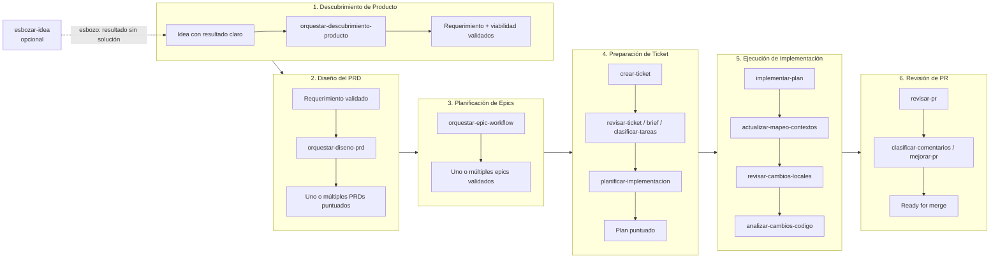
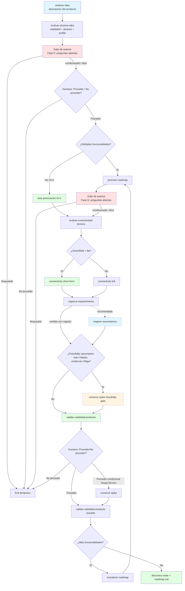
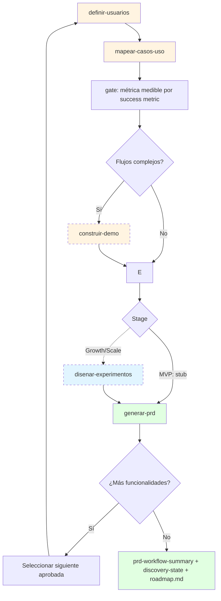
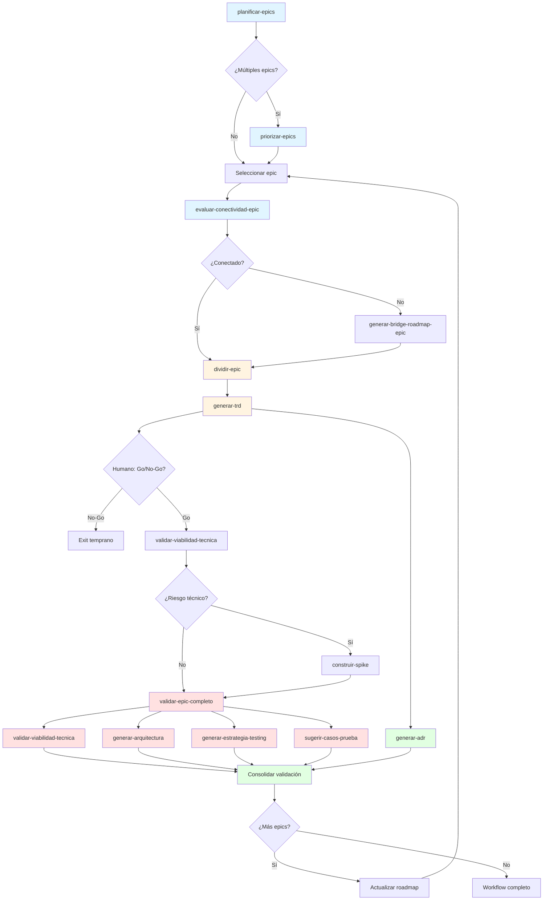
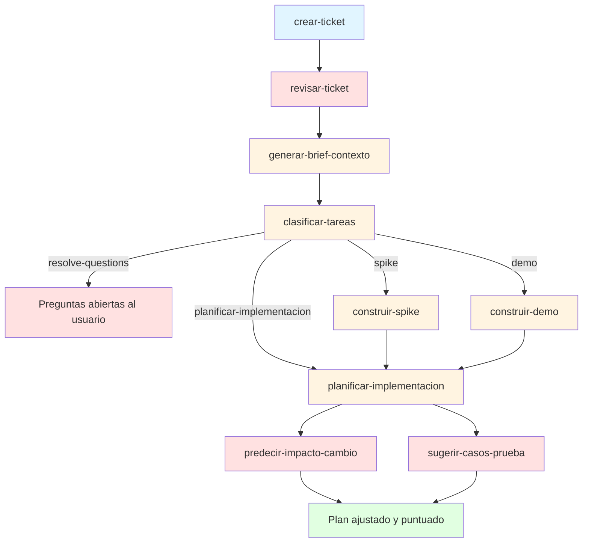
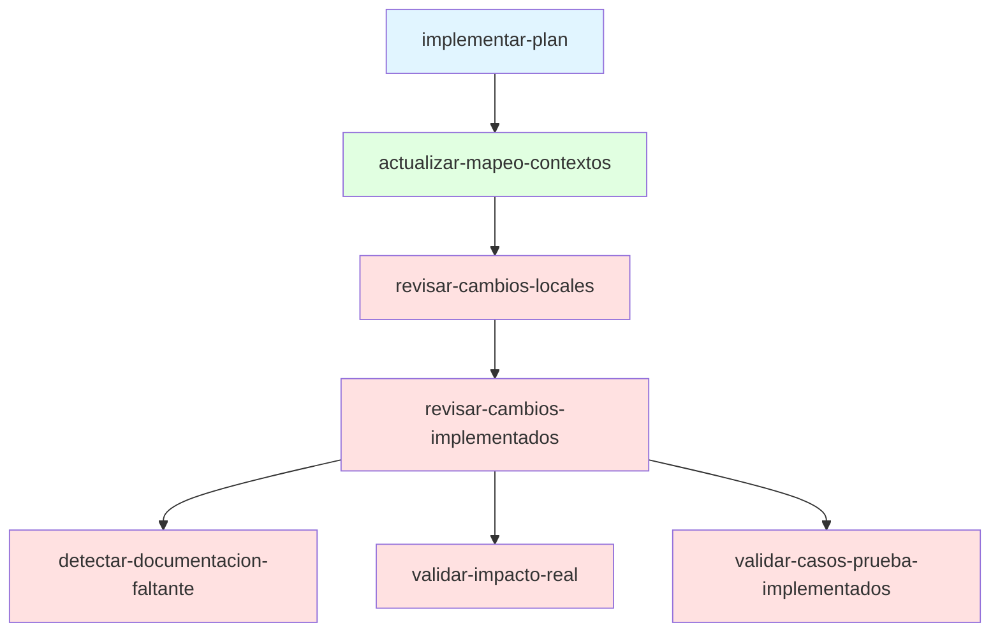
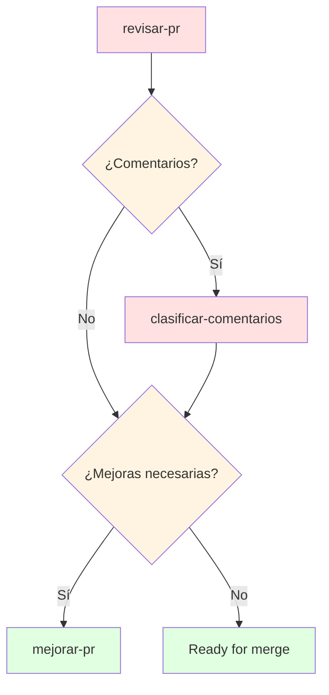
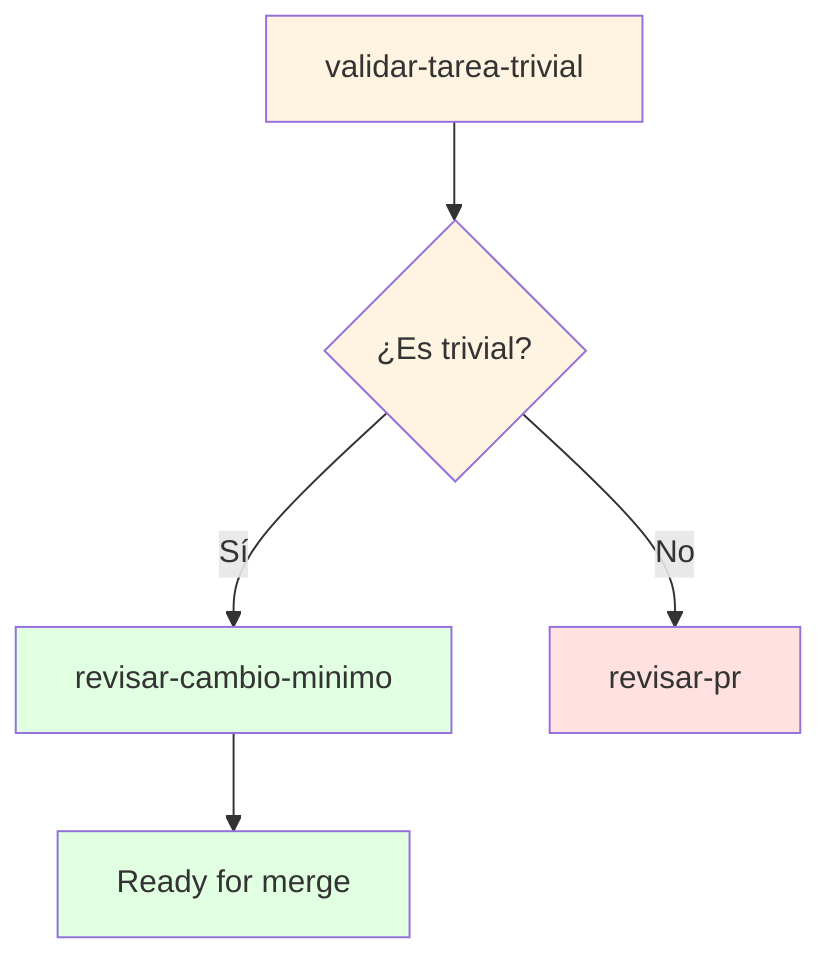
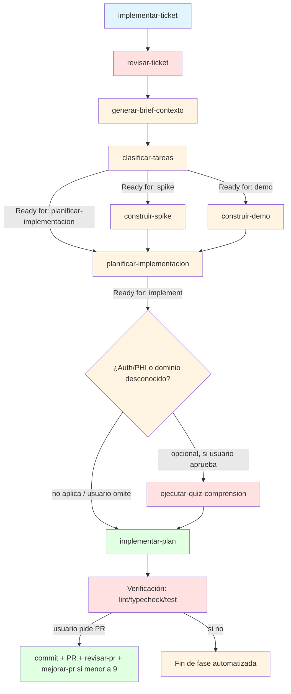
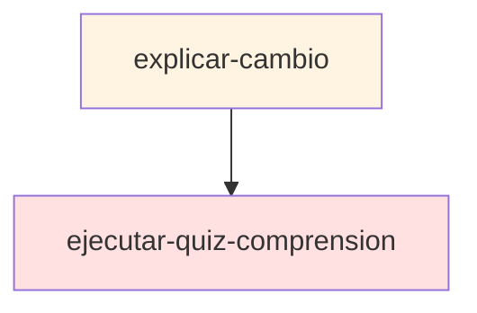

# Workflows de Skills

Este documento es el mapa de ruta para operar el proceso de producto→código mediante la librería de skills. Úsalo para saber en qué punto del proceso estás, qué skill sigue, y si conviene invocar un orquestador end-to-end o skills individuales a mano.

Cada workflow representa una sesión de trabajo con inicio y fin claros, agrupada por alcance, área de expertise y tipo de actividad, y se encadena con el siguiente para formar un proceso end-to-end completo: **Idea → PRD → Epic → Ticket → Implementación → PR → Merge**.

## Tabla de Contenidos

- [Diagrama Maestro: Proceso E2E Completo](#diagrama-maestro-proceso-e2e-completo)
- [Resumen de Workflows: Entrada / Salida / Ready for](#resumen-de-workflows-entrada--salida--ready-for)
- [Orquestadores y módulos transversales](#orquestadores-y-módulos-transversales)
- [Paso previo opcional: Esbozo de idea (`esbozar-idea`)](#paso-previo-opcional-esbozo-de-idea-esbozar-idea)
- [Workflow 1: Descubrimiento de Producto (Idea → Requerimiento validado)](#workflow-1-descubrimiento-de-producto-idea--requerimiento-validado)
- [Workflow 2: Diseño del PRD (Requerimiento → PRD)](#workflow-2-diseño-del-prd-requerimiento--prd)
- [Workflow 3: Gestión de Epics (Planificación Estratégica)](#workflow-3-gestión-de-epics-planificación-estratégica)
- [Workflow 4: Preparación de Ticket](#workflow-4-preparación-de-ticket)
- [Workflow 5: Ejecución de Implementación](#workflow-5-ejecución-de-implementación)
- [Workflow 6: Revisión de PRs](#workflow-6-revisión-de-prs)
- [Workflow 7: Implementación End-to-End (Orquestador)](#workflow-7-implementación-end-to-end-orquestador)
- [Módulo Transversal: Comprensión y Enseñanza](#módulo-transversal-comprensión-y-enseñanza)
- [Skills Desconectados / Standalone](#skills-desconectados--standalone)
- [Resumen de Interconexiones](#resumen-de-interconexiones)

## Diagrama Maestro: Proceso E2E Completo

## Resumen de Workflows: Entrada / Salida / Ready for

- **1. Descubrimiento de Producto**
  - Entrada: Idea con resultado claro (esbozo pulido por `esbozar-idea` — paso previo opcional — o idea bien formada del usuario)
  - Artefacto de salida: `requirements.md` + `product-viability.md` + `assumption-map.md` (recomendado) + `discovery-state.md` + `roadmap.md` consolidado del dominio
  - Ready for: `orquestar-diseno-prd`
- **2. Diseño del PRD**
  - Entrada: Requerimiento validado (`requirements.md` + `product-viability.md` con Go/Conditional Go)
  - Artefacto de salida: `prd.md` (uno o múltiples) + `personas-mapping.md` + `use-cases.md` + `experiment-design.md` (condicional) + `prd-workflow-summary.md` + `roadmap.md` actualizado
  - Ready for: `planificar-epics`
- **3. Gestión de Epics**
  - Entrada: PRD
  - Artefacto de salida: `tasks.md` por epic + validación completa
  - Ready for: `crear-ticket`
- **4. Preparación de Ticket**
  - Entrada: Epic-tasks o brief
  - Artefacto de salida: `implementation-plan.md` puntuado
  - Ready for: `implement`
- **5. Ejecución de Implementación**
  - Entrada: Plan puntuado
  - Artefacto de salida: Cambios locales verificados + `code-analysis-summary.md`
  - Ready for: Abrir PR
- **6. Revisión de PRs**
  - Entrada: PR abierto
  - Artefacto de salida: `pr-<N>-review.md` + comentarios postables
  - Ready for: `merge`
- **7. Implementación End-to-End**
  - Entrada: Ticket sin plan previo
  - Artefacto de salida: Código verificado localmente (orquesta 3 + parte de 4)
  - Ready for: Abrir PR (opcional)

## Orquestadores y módulos transversales

Los siguientes orquestadores automatizan workflows completos. Úsalos cuando quieras avanzar sin invocar cada skill a mano:

- **`orquestar-descubrimiento-producto`** orquesta el Workflow 1: `analizar-idea` → `evaluar-alcance-idea` → `priorizar-roadmap` → `evaluar-conectividad-tecnica` → `capturar-requerimiento` → `mapear-assumptions` (recomendado) → gate de spike por feasibility → `validar-viabilidad-producto`. Genera requerimiento validado y roadmap del dominio. `esbozar-idea` es el paso previo opcional cuando la idea aún no tiene un resultado claro.
- **`orquestar-diseno-prd`** orquesta el Workflow 2: `definir-usuarios` → `mapear-casos-uso` → `construir-demo` (opcional) → `disenar-experimentos` (condicional al stage) → `generar-prd`. Requiere los artefactos de descubrimiento (`requirements.md` + `product-viability.md`) y genera el PRD formal.
- **`orquestar-epic-workflow`** orquesta el Workflow 3 completo (incluyendo priorización de epics, evaluación de conectividad por epic, gates de Go/No-Go, rama opcional de spike técnico y loop de procesamiento para múltiples epics).
- **`implementar-ticket`** (Workflow 7) orquesta el Workflow 4 completo más la fase de codificación y verificación del Workflow 5. **No reemplaza al Workflow 5 completo**: no encadena automáticamente `actualizar-mapeo-contextos`, `revisar-cambios-locales` ni `revisar-cambios-implementados` (ver límite de alcance en Workflow 7).
- **Módulo transversal Comprensión y Enseñanza** puede insertarse como puerta opcional antes del Workflow 5 o antes del Workflow 6.
- **`esbozar-idea`** es un paso previo opcional al Workflow 1 (no es un orquestador). Conduce un chat interactivo que pulle una idea muy verde en un esbozo ligero (`docs/drafts/<slug>/esbozo.md`) que formula el resultado deseado sin soluciónizar. No está encadenado en `orquestar-descubrimiento-producto`; se invoca a mano cuando la idea no está lista para `analizar-idea`. Su salida alimenta `analizar-idea`, que toma el resultado y describe el producto que lo resuelve.
- **`analizar-idea`** es el primer skill del Workflow 1. Toma una idea con resultado claro (esbozo de `esbozar-idea` o idea bien formada del usuario) y redacta una descripción narrativa de la funcionalidad o producto que la resuelve: problema, estado final y producto que puentea entre ambos, sin detalles técnicos ni de implementación. El resultado es un borrador ligero de la solución (`docs/<domain>/idea/<IDEA-SLUG>/idea-analysis.md`) que sirve como punto inicial para `evaluar-alcance-idea`. No evalúa viabilidad ni declara `profile` — eso es `evaluar-alcance-idea`, el siguiente skill.

### ¿Cuándo usar cada orquestador?

Usa `orquestar-descubrimiento-producto` para decidir si una idea vale la pena y entregar el requerimiento validado. Usa `orquestar-diseno-prd` después, cuando el requerimiento ya tenga viabilidad Go/Conditional Go y se quiera producir el PRD. Usa skills individuales cuando se reanuda desde `workflow-state.md` o se pide una fase concreta.

---

## Paso previo opcional: Esbozo de idea (`esbozar-idea`)

Antes del Workflow 1, cuando la idea está muy verde o vaga para entrar al flujo, `esbozar-idea` conduce un chat interactivo de ida y vuelta que la pulle en un esbozo ligero y bien formado.

- **Entrada**: idea bruta vaga (texto libre del usuario).
- **Artefacto de salida**: `docs/drafts/<IDEA-SLUG>/esbozo.md` — artefacto temporal de staging (vive fuera de `docs/<domain>/` porque la idea aún no está comprometida con un dominio ni con el flujo 1).
- **Ready for**: `analizar-idea` / `bloqueado`.

**Límite de alcance**: el esbozo es deliberadamente ligero — declara el resultado deseado sin soluciónizar, beneficiarios y motivación. **No** describe el producto que resuelve el resultado (eso es `analizar-idea`), ni evalúa viabilidad preliminar (eso es `evaluar-alcance-idea`), ni estructura requerimientos (`capturar-requerimiento`), ni divide alcance (`evaluar-alcance-idea`), ni define personas/casos de uso/métricas. El esbozo se escribe para que `analizar-idea` pueda describir el producto sin tener que reformular el resultado primero.

No es parte de ningún orquestador — se invoca a mano cuando hace falta. Si la idea ya tiene un resultado claro, se omite y se entra directo al Workflow 1 con `analizar-idea`.

---

## Workflow 1: Descubrimiento de Producto (Idea → Requerimiento validado)

Workflow que transforma una idea de producto bruta en uno o múltiples requerimientos estructurados y validados por viabilidad de negocio. Detiene el proceso antes de invertir en personas, casos de uso y PRD: si el veredicto es No-Go, la idea se rechaza o pospone. Incluye descripción narrativa del producto, evaluación de alcance, priorización RICE, evaluación de conectividad técnica, captura del requerimiento, mapeo de assumptions y gate de viabilidad.

**Propósito**: Convertir una idea informal en uno o múltiples requerimientos estructurados, validados por viabilidad de negocio, antes de invertir en personas, casos de uso o PRD. Incluye descripción narrativa del producto que resuelve el resultado, evaluación de alcance para evitar requerimientos gigantescos, priorización inteligente basada en RICE, evaluación de conectividad con el codebase actual, mapeo de assumptions (framework de David Bland), gates de calidad de razonamiento (no-solutionización, spike por feasibility) y decisión Go/No-Go por viabilidad de producto.

**Descripción narrativa**: Este workflow inicia con `analizar-idea`, que toma una idea con resultado claro (esbozo de `esbozar-idea` o idea bien formada del usuario) y redacta una descripción narrativa del producto o funcionalidad que la resuelve. Evalúa:

1. **Descripción del producto**: `analizar-idea` toma el resultado deseado (proveniente del esbozo o del input del usuario) y describe el producto o funcionalidad que lo resuelve en términos de experiencia: el problema, el estado final y el producto que puentea entre ambos, sin mencionar tecnología, arquitectura ni implementación. Si el resultado no está claro o no puede formularse, sugiere usar `esbozar-idea` primero. Diagnostica la madurez de la idea (Verde / Borrador / Casi lista) y su nivel (Producto / Feature), que modulan el alcance del diálogo. Resuelve el **dominio** (`docs/<domain>/`) inventariando dominios existentes, infiriendo candidatos y filtrando por nivel (Feature → dominio existente; Producto → nuevo o existente) — esta ruta fija la ubicación de todos los artefactos downstream del workflow. Genera `docs/<domain>/idea/<IDEA-SLUG>/idea-analysis.md` — un borrador ligero de la solución que sirve como punto inicial para el resto del workflow.

2. **Viabilidad preliminar + alcance + profile**: `evaluar-alcance-idea` actúa como gate de fail-fast. Primero evalúa **alineación estratégica** (consistencia con la dirección del producto, si mueve un norte explícito, esencial vs deseable, foco vs dispersión) y produce un veredicto **Alineado / Parcialmente alineado / Desalineado**. Si es Desalineado, el workflow se detiene sin invertir en alcance. Si procede, determina si la idea describe múltiples funcionalidades independientes (ej: "sistema de notificaciones + sistema de archivos") o una funcionalidad cohesiva (ej: "alertas de inactividad"). Si son múltiples, las divide en elementos individuales con alcance, propuesta de valor y cronograma. Además, declara un campo `profile: full | lite` que el orquestador consume para activar shortcuts (stub RICE N=1, connectivity short-form, 1 persona, experiment-design omitido por defecto): `lite` aplica a producto interno o funcionalidad cohesiva única; `full` a producto externo o múltiples funcionalidades. La **Fase E** clasifica el estado de avance preliminar que drivea el branching: funcionalidad única → `next: evaluar-conectividad-tecnica`; múltiples → `next: priorizar-roadmap`. Finalmente, la **Fase F (Gate de Avance Condicionado)** es obligatoria: inventaría las preguntas abiertas identificadas durante el análisis, las clasifica por severidad (Crítica / Importante / Menor) y determina el estado de avance — **bloqueado** (Críticas sin resolver → `Ready for: bloqueado`), **condicionado** (Importantes sin resolver → alerta al usuario, ofrece responder o avanzar con default conservador) o **libre** (solo Menores o todas resueltas). El gate se documenta en una subsección "Gate de avance (Fase F)" del artefacto; sin esa evidencia el documento no se considera completo. Genera `docs/<domain>/idea/<IDEA-SLUG>/scope-roadmap.md`.

3. **Priorización**: `priorizar-roadmap` calcula puntuaciones RICE (Alcance × Impacto × Confianza / Esfuerzo) para cada funcionalidad, generando `docs/<domain>/idea/<IDEA-SLUG>/feature-prioritization.md` con ranking basado en valor vs esfuerzo. Ajusta por dependencias, marcando elementos bloqueados. Acepta como entrada `scope-roadmap.md` (funcionalidades) o `bridge-roadmap.md` (features puente). **Path lite (N=1)**: si `scope-roadmap.md` declara "funcionalidad única", emite un stub con el score RICE como sanity check (no roadmap ranqueado) — reduce ceremonia para MVPs dogfooding. Al igual que `evaluar-alcance-idea`, ejecuta la **Fase G (Gate de Avance Condicionado)** obligatoria: inventaría preguntas abiertas de las Fases B/C/D, las clasifica por severidad (Crítica / Importante / Menor) y determina el estado de avance — **bloqueado** (Críticas sin resolver), **condicionado** (Importantes sin resolver → alerta al usuario) o **libre** (solo Menores o todas resueltas). El gate se documenta en una subsección "Gate de avance (Fase G)"; sin esa evidencia el documento no se considera completo.

4. **Conectividad**: `evaluar-conectividad-tecnica` analiza el codebase actual (auth, DB, APIs, servicios, frontend, monitoring) para identificar prerequisitos existentes. Determina si la funcionalidad está conectada (prerequisitos existen), desconectada (falta infraestructura crítica) o **greenfield** (repo sin codebase/producto previo — conectado por vacío, sin prerequisitos previos que falten). En modo greenfield el paso no se salta: genera el artefacto obligatorio con veredicto "conectado (greenfield)" como registro de la decisión. **Path lite (greenfield + profile=lite)**: emite un short-form (tabla mínima de componentes a crear, sin enumerar cada categoría de infraestructura como N/A). Si está desconectada, genera plan de trabajo de funcionalidades puente que construyen la infraestructura necesaria paso a paso, escribiendo `docs/<domain>/idea/<IDEA-SLUG>/connectivity/bridge-roadmap.md`.

El orquestador del descubrimiento selecciona la funcionalidad más prioritaria y ejecuta: `capturar-requerimiento` → `mapear-assumptions` (recomendado) → **gate de spike por feasibility assumption** → `validar-viabilidad-producto`. Después de validar cada funcionalidad, verifica si hay más funcionalidades pendientes. Si sí, selecciona la siguiente prioritaria y repite. Si no, genera los artefactos de cierre del descubrimiento: `docs/<domain>/idea/<IDEA-SLUG>/discovery-state.md` con el estado del roadmap y `docs/<domain>/roadmap.md` consolidado del dominio.

5. **Requerimiento**: `capturar-requerimiento` estructura la idea en documento formal con problema, audiencia afectada, solución propuesta y restricciones, escribiendo `docs/<domain>/idea/<IDEA-SLUG>/<FUNCIONALIDAD-SLUG>/captured-requirement.md` (o `requirements.md` si el proyecto prefiere ese nombre). **Gate de no-solutionización**: las "Decisiones resueltas" solo pueden ser de tipo (a) restricciones de timing/recursos/negocio, (b) restricciones de tech stack impuestas externamente, (c) decisiones de alcance. NO se permiten decisiones de diseño de solución — esas se toman en `generar-prd` (Workflow 2).

6. **Assumptions**: `mapear-assumptions` (**recomendado, no bloqueante**) identifica assumptions en 4 buckets, genera matriz riesgo/evidencia y escribe `assumption-map.md`. Si hay assumptions de feasibility de riesgo medio/alto, el orquestador dispara `construir-spike` antes de `validar-viabilidad-producto`. Si se omite, registra stub o justificación.

7. **Viabilidad de producto**: `validar-viabilidad-producto` evalúa alineación estratégica, demanda, recursos y riesgo de negocio, y escribe `product-viability.md` con veredicto Proceder/Proceder condicional/No proceder.

- Si el veredicto es **No proceder**, el workflow se detiene.
- Si el veredicto es **Proceder condicional** por riesgo técnico no resuelto, `Ready for: spike` dirige a `construir-spike` para resolver la incógnita. Resuelta, el workflow retoma validación.
- Si el veredicto es **Proceder**, la funcionalidad pasa al **Workflow 2** para diseño de PRD.

**Entry point recomendado**: `orquestar-descubrimiento-producto [IDEA-DESCRIPCION]` automatiza todo el workflow. El algoritmo de reconstrucción de estado vive en `references/state-reconstruction.md`.

---

## Workflow 2: Diseño del PRD (Requerimiento → PRD)

Workflow que toma uno o más requerimientos validados y los convierte en PRDs formales, con definición de usuarios, casos de uso, experimentos condicionales y generación del PRD.

**Propósito**: Transformar requerimientos validados en PRDs formales con personas, casos de uso concretos y criterios experimentales estado-específicos. Solo corre para funcionalidades que recibieron Go o Conditional Go en el Workflow 1.

**Entrada**: `requirements.md` + `product-viability.md` (Go/Conditional Go) + `assumption-map.md` (recomendado) de una o más funcionalidades aprobadas.

**Descripción narrativa**:

1. **Definir usuarios**: `definir-usuarios` detalla personas primarias y secundarias. **Path lite (profile=lite)**: 1 persona primaria + 0-1 secundaria. **Path full**: 2-3 personas. Usa personas canónicas compartidas por dominio y un mapeo por PRD (`personas-mapping.md`).

2. **Mapear casos de uso**: `mapear-casos-uso` mapea happy path, alternativas, edge cases, precondiciones y postcondiciones, y escribe `use-cases.md`.

3. **Demo opcional**: `construir-demo` hace visible el comportamiento de flujos complejos cuando el equipo lo necesita. No reemplaza al PRD.

4. **Experimentos condicionales**: `disenar-experimentos` solo en stage Growth/Scale. En MVP se omite con stub.

5. **Generar PRD**: `generar-prd` consolida todo en `prd.md` con `Ready for: planificar-epics`.

**Entry point recomendado**: `orquestar-diseno-prd [PRD-SLUG]` automatiza el diseño del PRD a partir de los artefactos de descubrimiento.

El PRD resultante es la entrada directa del **Workflow 3**.

---

## Workflow 3: Gestión de Epics (Planificación Estratégica)

Workflow que transforma un PRD en uno o múltiples epics validados con documentación técnica completa, con priorización basada en valor vs esfuerzo, evaluación de conectividad por epic, gates de Go/No-Go en múltiples puntos, rama opcional de spike técnico ante riesgos no resueltos y loop de procesamiento para múltiples epics. Incluye validación técnica, arquitectura visual, estrategia de testing y decisiones arquitectónicas documentadas.

**Propósito**: Convertir iniciativas de producto (PRDs) en uno o múltiples epics estructurados con validación técnica, arquitectura visual, estrategia de testing y decisiones arquitectónicas documentadas. Incluye priorización de epics basada en RICE, evaluación de conectividad por epic con features puente cuando está desconectado, gates de Go/No-Go en múltiples puntos (TRD, viabilidad técnica, validación completa), rama opcional de spike técnico ante riesgos no resueltos y loop de procesamiento para múltiples epics.

**Descripción narrativa**: Este workflow comienza con validación de entrada: verifica que el PRD proviene del **Workflow 2** y tiene `Ready for: planificar-epics`. Si el PRD no cumple, sugiere ejecutar el Workflow 2 primero.

1. **Planificación de epics**: `planificar-epics` analiza el PRD (Fase A: validar objetivo, usuarios, criterios de éxito, **y consume el veredicto condicional de `product-viability.md`** — si fue Conditional Go, mapea las condiciones heredadas a riesgos/prerequisitos por epic), **consume el artefacto de conectividad del descubrimiento** (`prerequisites-assessment.md` — si greenfield, skip del grep por arquitecturas existentes; si no, lo usa como punto de partida) (Fase B), estructura **1-7 epics** (1-3 para funcionalidad única con fases internas lineales, 3-7 para múltiples funcionalidades) donde cada epic entrega **valor verificable** (independencia de deploy deseable pero no obligatoria para features secuenciales) (Fase C), mapea dependencias entre epics (Fase D) y genera `docs/<domain>/initiatives/<PRD-SLUG>/epics/epic-plan.md` (Fase E).

2. **Priorización de epics**: Si hay múltiples epics, `priorizar-epics` calcula scores RICE (Reach × Impact × Confidence / Effort) para cada epic, generando `docs/<domain>/initiatives/<PRD-SLUG>/epic-prioritization.md` con ranking basado en valor vs esfuerzo. Ajusta por dependencias, marcando epics bloqueados. El orquestador selecciona el epic más prioritario.

3. **Conectividad por epic**: `evaluar-conectividad-epic` analiza el codebase actual (auth, DB, APIs, servicios, frontend, monitoring) para identificar prerequisitos existentes específicos del epic seleccionado. Determina si el epic está conectado (prerequisitos existen) o desconectado (falta infraestructura crítica). Si está desconectado, genera roadmap de features puente que construyen la infraestructura necesaria paso a paso, escribiendo `docs/<domain>/initiatives/<PRD-SLUG>/epics/<EPIC-SLUG>/bridge-roadmap.md`.

4. **División del epic**: `dividir-epic` carga el epic seleccionado y el contexto técnico (Fase A), divide el epic en 5-12 tareas atómicas con AC, archivos que toca y estimaciones 1-8 puntos (Fase B), mapea artefactos del codebase por tarea (Fase C), detecta dependencias entre tareas (Fase D) y genera `docs/<domain>/initiatives/<PRD-SLUG>/epics/<EPIC-SLUG>/tasks.md` (Fase F).

5. **TRD y gate de revisión**: `generar-trd` analiza AC técnicos del epic (Fase A), especifica arquitectura general, modelos de datos, APIs, integraciones y comportamientos críticos (Fases B-E), define testing strategy y riesgos (Fases F-G) y genera `docs/<domain>/initiatives/<PRD-SLUG>/epics/<EPIC-SLUG>/trd.md` (Fase H). Este punto actúa como **gate** de revisión de requisitos técnicos antes de invertir en arquitectura. Si el humano marca No-Go, el workflow se detiene sin invertir más tiempo.

6. **Rama opcional de spike técnico**: `validar-viabilidad-tecnica` analiza el codebase, valida construcciones nuevas vs reutilización, identifica deuda técnica bloqueante, compara con precedentes, detecta brechas de infraestructura y genera `docs/<domain>/initiatives/<PRD-SLUG>/epics/<EPIC-SLUG>/viability-assessment.md`. Si detecta riesgo técnico no resuelto (tecnología desconocida, integración incierta), `Ready for: spike` dirige a `construir-spike`, que responde la pregunta de diseño puntual con un boceto desechable y notas de hallazgos. El spike no implementa la feature real; solo resuelve la incógnita técnica antes de invertir en arquitectura. Resuelta la pregunta, el workflow retoma en `validar-epic-completo`.

7. **Validación completa del epic**: El orquestador `validar-epic-completo` ejecuta en secuencia:
   - `validar-viabilidad-tecnica` (si no se ejecutó antes o tras el spike)
   - `generar-arquitectura` (analiza TRD para componentes, crea diagramas Mermaid de componentes, flujos y deployment, define matriz de comunicación, escalabilidad, resiliencia, seguridad y monitoreo, genera `docs/<domain>/initiatives/<PRD-SLUG>/epics/<EPIC-SLUG>/architecture.md`)
   - `generar-estrategia-testing` (identifica componentes críticos, aplica metodología ZOMBIE por componente, define matriz de cobertura unit/integration/E2E, especifica test data strategy y validaciones por layer, genera `docs/<domain>/initiatives/<PRD-SLUG>/epics/<EPIC-SLUG>/test-strategy.md`)
   - `sugerir-casos-prueba` (analiza el epic plan para generar test cases a nivel de epic, genera happy path, edge cases, error cases, boundary cases, side effects, concurrency e integration cases con ejemplos concretos, genera `docs/<domain>/initiatives/<PRD-SLUG>/epics/<EPIC-SLUG>/test-cases.md`)

8. **ADRs**: Paralelamente, `generar-adr` toma el TRD, identifica 2-5 decisiones arquitectónicas clave (Fase A), genera ADRs en formato MADR con Context, Decision, Rationale, Consequences y Alternatives (Fase B), crea referencias cruzadas con TRD y tareas (Fase E) y escribe `docs/<domain>/adr/ADR-001-*.md` (Fase F).

9. **Consolidación y gate final**: El orquestador consolida todos los hallazgos en `docs/<domain>/initiatives/<PRD-SLUG>/epics/<EPIC-SLUG>/complete-validation.md` con matriz de decisión y plan de acción. Este punto actúa como **gate final** de aprobación antes de pasar a implementación. Si el humano marca No-Go, el workflow se detiene.

10. **Loop de procesamiento**: Después de validar un epic, el orquestador verifica si hay más epics pendientes en el roadmap. Si sí, actualiza el estado en `docs/<domain>/initiatives/<PRD-SLUG>/epic-roadmap-state.md`, selecciona el siguiente epic prioritario y repite el proceso desde la evaluación de conectividad. Si no, genera `docs/<domain>/initiatives/<PRD-SLUG>/workflow-summary.md` con el resumen consolidado de todos los epics validados, matriz de decisión global y plan de acción.

**Camino alternativo ligero**: cuando no se necesita el paquete completo de `validar-epic-completo` (viabilidad técnica + arquitectura + test strategy) sino solo un chequeo rápido de documentación, impacto predicho y test cases sobre el epic plan, `analizar-cambios-codigo` ejecuta `detectar-documentacion-faltante` → `predecir-impacto-cambio` → `sugerir-casos-prueba` en secuencia y genera un resumen consolidado. No sustituye a `validar-epic-completo`: es un análisis más liviano para epics de bajo riesgo o iteraciones sobre un epic ya validado antes. Su contraparte de tickets (Workflow 5) es `revisar-cambios-implementados`, que además valida impacto real vs. predicho.

**Entry point recomendado**: `orquestar-epic-workflow [PRD-PATH]` automatiza las 10 fases con los mismos gates, incluyendo las tres ramas opcionales (priorización de epics para múltiples epics, features puente para epics desconectados, spike ante riesgo técnico no resuelto), loop de procesamiento para múltiples epics, consolida los artefactos y escribe `docs/<domain>/initiatives/<PRD-SLUG>/workflow-summary.md` con `Ready for: crear-ticket`. Las ramas opcionales solo se ejecutan cuando su condición dispara — no corren en cada invocación.

**Skills nuevos creados para este workflow:**

- `priorizar-epics` - Prioriza epics usando metodología RICE
- `evaluar-conectividad-epic` - Evalúa prerequisitos técnicos por epic
- `orquestar-epic-workflow` - Orquestador centralizado del workflow completo

**Skills actualizados:**

- `planificar-epics` - Agregada validación de `Ready for: planificar-epics` en el PRD
- `generar-trd` - Agregado gate de Go/No-Go después de generar el TRD
- `validar-epic-completo` - Agregado gate final de Go/No-Go antes de consolidar validación

Los epics validados (`docs/<domain>/initiatives/<PRD-SLUG>/epics/<EPIC-SLUG>/tasks.md`) son la entrada de `crear-ticket` en el **Workflow 4**.

---

## Workflow 4: Preparación de Ticket

Sesión de trabajo de análisis y planificación: desde una idea, epic o brief hasta un plan de implementación puntuado listo para codificar. No escribe código de producción.

**Propósito**: Pipeline de análisis previo a la codificación: crea o carga el ticket, lo pasa por gate de calidad, construye contexto de investigación, decide si hace falta desbloquear preguntas de diseño (spike) o visibilidad de runtime (demo) antes de planificar, y produce un plan de implementación puntuado con impacto y test cases predichos.

**Descripción narrativa**:

1. **Creación del ticket**: `crear-ticket` resuelve la entrada desde conversación, brief, notas, seguimiento de PR o el epic-task producido por el Workflow 3 (Fase 0), usa subagentes en paralelo para búsqueda en herramientas de gestión, documentación y pase de codebase/convention (Fase A), redacta el borrador con Problema, Alcance (in/out), Requisitos, Testing/QA, Criterios de aceptación, Preguntas abiertas y Referencias (Fase B), puntúa según draft-rating-rubric y genera el archivo `docs/<domain>/<slug>.md` (Fase C).

2. **Gate de calidad del ticket**: `revisar-ticket` carga el ticket y brief de investigación (Fase A), usa subagentes en paralelo para ticket-deps, feasibility y conventions (Fase A), evalúa problema, AC, alcance, dependencias, estimación, factibilidad y drift a plan de implementación (Fase B), genera brief de revisión con puntuación, hallazgos estructurados y Ready for (Fase C).

3. **Brief de contexto**: si el ticket pasa (Ready for = context-brief o plan), `generar-brief-contexto` toma el ticket, usa subagentes en paralelo para ticket-deps, docs y codebase (Fase A), investiga y verifica cruzadamente comportamiento actual contra codebase citando ≥3 rutas de entry-point (Fase B), genera research brief con resumen del ticket, mapa de epic/dependencias, notas de producto, estado actual del codebase, brechas vs AC, riesgos, Preguntas abiertas y outline sugerido (Fase C), escribiendo `docs/<domain>/<TICKET-SLUG>-context-brief.md`.

4. **Gate de triage**: `clasificar-tareas` hace verificación cruzada con el codebase citando ≥2 rutas reales de entry points, divide ítems de trabajo en Primary (requiere juicio: diseño, lógica de dominio, límites de auth/PHI, contratos de API, decisiones arquitectura) y Secondary (preparación/apalancamiento: mapas del codebase, plomería de fixtures, limpieza de lint/tipos, docs, scaffolding de tests), anota dependencias entre ítems, elige próximo paso mapeado al ítem Primary de mayor riesgo y genera `docs/<domain>/<TICKET-SLUG>-ticket-work-triage.md` con puntuación y Ready for:
   - **`resolve-questions`**: hay preguntas abiertas bloqueantes; se detiene y se le pide al usuario resolverlas.
   - **`spike`**: una pregunta de diseño no está clara; `construir-spike` la resuelve con un boceto desechable antes de planificar.
   - **`demo`**: se necesita ver comportamiento en runtime (state machines, sync, edge cases) antes de planificar; `construir-demo` construye el artefacto ejecutable temporal.
   - **`planificar-implementacion`**: no hay bloqueos, se procede directo a planificar.

5. **Planificación**: resuelto el spike o demo (si aplicó), `planificar-implementacion` usa subagentes en paralelo para context-load, ticket-deps y conventions (Fase A), mapea cada AC a un paso del plan, lista efectos de segundo orden, produce guía paso a paso con commits pequeños (propósito + archivos + tests), nombra comandos de validación dirigidos (Fase B), genera plan puntuado `docs/<domain>/<TICKET-ID>-implementation-plan.md` (Fase C).

6. **Análisis pre-implementación (paralelo)**: después de `planificar-implementacion`, se ejecutan en paralelo `predecir-impacto-cambio` y `sugerir-casos-prueba`.
   - `predecir-impacto-cambio` analiza el plan para detectar breaking changes, mapear dependencias downstream, predecir impacto en performance y seguridad, e identificar esfuerzo de cascade updates (Fase A), genera `docs/<domain>/<TICKET-ID>-impact-analysis.md` con matriz de riesgos y timeline (Fase B).
   - `sugerir-casos-prueba` analiza el plan para identificar happy path, edge cases, error cases, boundary cases, side effects, concurrency e integration cases (Fase A), genera `docs/<domain>/<TICKET-ID>-test-cases.md` con matriz de cobertura y recomendaciones (Fase B).

El resultado es un plan puntuado (≥9, `Ready for: implement`) con impacto y test cases predichos, listo para el **Workflow 5**.

---

## Workflow 5: Ejecución de Implementación

Sesión de trabajo de codificación y validación: desde un plan puntuado hasta cambios locales listos para PR, con documentación, mapa de dominio y cobertura de tests verificados contra lo predicho en el Workflow 4.

**Propósito**: Ejecutar el plan puntuado como cambios locales, mantener el domain map sincronizado, pasar el gate de revisión local y validar retrospectivamente que la documentación, el impacto real y la cobertura de tests coinciden con lo predicho en 2a — antes de abrir PR.

**Descripción narrativa**:

1. **Implementación**: este workflow toma el plan ajustado con consideraciones de impacto y test cases (salida del Workflow 4) como entrada de `implementar-plan`, que aplica gates de readiness del plan (Fase 0), carga el plan y confirma working tree limpio (Fase A), ejecuta la guía paso a paso aplicando cambios locales pequeños, ejecutando validación dirigida después de cada chunk, siguiendo convenciones del proyecto y citando ≥2 rutas de archivos hermanos (Fase B), genera notas de implementación con cambios aplicados, cobertura de AC, resultados de validación y seguimientos (Fase C), escribiendo `docs/<domain>/<TICKET-ID>-implementation-notes.md`.

2. **Sincronización del domain map**: `actualizar-mapeo-contextos` carga el plan o diff de rama (Fase A), analiza cambios de dominio clasificando nuevas agregaciones, relaciones, contextos limitados y APIs públicas (Fase B), actualiza `docs/<domain>/domain-map.md` con nuevas agregaciones, contextos, relaciones inter-contexto y APIs (Fase C), detecta architectural smells (duplicación, ciclos) y valida integridad del domain map (Fases D-F).

3. **Gate antes de PR**: `revisar-cambios-locales` carga el ticket/brief y diff local vs base (Fase A), ejecuta checklist completo de AC, valida comandos de validación, cita pase de convenciones (≥2 rutas hermanas) y nota efectos de segundo orden (Fase B), genera resumen en chat con puntuación, estado de AC, hallazgos y Ready for, y opcionalmente escribe `docs/<domain>/<TICKET-SLUG>-local-review.md` (Fases C-D).

4. **Validación post-implementación**: el orquestador `revisar-cambios-implementados` toma el plan o rama y ejecuta en secuencia tres sub-skills:
   - `detectar-documentacion-faltante` analiza código nuevo, valida docstrings de funciones públicas, comentarios en lógica compleja, ejemplos de APIs, edge cases documentados, decisiones arquitectónicas en ADRs, README/setup docs y TODOs/FIXMEs bien formados. Genera `docs/<domain>/<TICKET-ID>-documentation-gaps.md` con gaps críticos/mayores/menores.
   - `validar-impacto-real` compara el impacto predicho en `docs/<domain>/<TICKET-ID>-impact-analysis.md` con el impacto real del código implementado, valida que los breaking changes detectados fueron mitigados y verifica que los servicios downstream afectados fueron notificados/actualizados. Genera `docs/<domain>/<TICKET-ID>-impact-validation.md` con veredicto de validación.
   - `validar-casos-prueba-implementados` compara los casos de prueba sugeridos en `docs/<domain>/<TICKET-ID>-test-cases.md` con los tests implementados, valida cobertura de happy path, edge cases, error cases, etc., e identifica gaps de cobertura. Genera `docs/<domain>/<TICKET-ID>-test-coverage-validation.md` con matriz de implementación y recomendaciones.

El orquestador consolida todos los hallazgos en `docs/<domain>/<TICKET-ID>-code-analysis-summary.md` con checklist de acción (bloqueadores/mayores/menores/testing/cascade) y timeline consolidado. El resultado son cambios locales verificados, listos para abrir PR y entrar al **Workflow 6**.

> **Nota**: el Workflow 4 (Preparación) y el Workflow 5 (Ejecución), en conjunto, cubren el mismo alcance que el antiguo "Workflow 3: Implementación de Tickets" — se dividieron en dos sesiones de trabajo (planificación vs. ejecución) porque tienen expertise, artefactos de entrada/salida y puntos de pausa naturales distintos. El Workflow 7 (`implementar-ticket`) orquesta el Workflow 4 completo y solo la parte de codificación del Workflow 5 (ver más abajo).

---

## Workflow 6: Revisión de PRs

Workflow para revisar y mejorar Pull Requests, con fast-track para cambios triviales (XS).

**Fast-track para cambios XS**:

**Propósito**: Revisión estructurada de PRs con clasificación de comentarios y ciclo de mejora, con fast-track para cambios pequeños.

**Descripción narrativa**: El workflow tiene **dos caminos** según el tamaño del cambio.

**Camino A — Fast-track para cambios XS (triviales)**:

1. **Gate de trivialidad**: `validar-tarea-trivial` determina si el cambio califica para fast-track (<5 archivos, <50 líneas neto, mismo dominio, sin migraciones). Si no califica, deriva al Camino B.

2. **Revisión mínima**: `revisar-cambio-minimo` valida pre-condición, ejecuta checklist rápido (funcionalidad: lógica correcta, no bugs obvios, tests verdes; testing: ≥1 test nuevo, tests existentes pasan; documentación básica: docstring si función pública nueva, comentarios si lógica no obvia; no breaking changes: no removed endpoints/renamed fields/type changes/required fields sin default; security básico: no hardcoded secrets, no SQL injection/XSS/auth bypass) y genera veredicto rápido (approve/minor changes/escalate) con Ready for (merge/needs-minor-fixes/full-review/blocked).

**Camino B — Revisión completa (cambios no triviales)**:

1. **Revisión del PR**: `revisar-pr` carga o genera brief de contexto puntuado (busca `docs/**/<TICKET-ID>-context-brief.md` o ejecuta `context-brief` si falta o puntuación < 9), carga diff completo del PR e hilos de revisión existentes, ejecuta checklist de AC, valida comandos de validación, cita pase de convenciones (≥2 rutas hermanas) y nota efectos de segundo orden, genera brief de revisión `docs/<domain>/<TICKET-ID>-pr-<PR-NUMBER>-review.md` con puntuación del cambio, checklist de AC, hallazgos por severidad, estado de validación, pase de convenciones, efectos de segundo orden, puntuación del brief y Ready for (merge-nits-only/improve/blocked), y genera archivo de comentarios postables `docs/<domain>/<TICKET-ID>-pr-<PR-NUMBER>-review-comments.md`.

2. **Clasificación de comentarios**: si hay comentarios abiertos, `clasificar-comentarios` carga fuentes resueltas, REVIEW-COMMENTS-DOC y PRIOR-TRIAGE-DOC, enumera hilos de revisión abiertos excluyendo resueltos/ya procesados, agrupa comentarios temáticamente, compara patrones con archivos similares citando rutas hermanas para veredictos disagree/partially agree, produce bloques por hilo con veredicto, severidad (blocker/important/nit/out of scope), caso con citas, respuesta propuesta y acción (implement fix/reply and resolve/ask clarifying question/defer), genera clasificación `docs/<domain>/<TICKET-ID>-pr-<PR-NUMBER>-comments-triage.md` con resumen de grupos, convenciones disputadas, bloques por hilo, lista de acciones ordenada, fuera del alcance, puntuación y Ready for (yes/no con blockers).

3. **Mejora del PR**: si la revisión indica mejoras (Ready for = improve), `mejorar-pr` carga ticket y opcionalmente REVIEW-DOC-SLUG, relee AC, lee hallazgos de revisión previa o ejecuta revisión temática completa si falta, puntúa el PR con rúbrica (10: todo AC cumplido, validación dirigida pasa, cero hallazgos; 9: máximo 3 nits; 8: ≥1 important; 7: deuda arquitectura; 5-6: AC parcial/faltante; 1-4: enfoque incorrecto o blocker), aplica correcciones en cambios locales pequeños ordenando hallazgos de blocker a important, coincide con convenciones, cubre regresiones con tests dirigidos, vuelve a puntuar y genera notas de mejora con puntuación inicial/final, correcciones aplicadas, vacíos restantes, nits opcionales, seguimientos y Ready for (local-review/corregir-mas-localmente/blocked).

El resultado es un PR listo para merge con calidad garantizada, cerrando el proceso e2e iniciado en el Workflow 1.

---

## Workflow 7: Implementación End-to-End (Orquestador)

Workflow orquestado (`implementar-ticket`) que automatiza el Workflow 4 completo más la fase de codificación y verificación del Workflow 5, con las mismas ramas de spike/demo/quiz que sus contrapartes manuales.

> **Límite de alcance conocido**: a diferencia del Workflow 5 manual, `implementar-ticket` no encadena automáticamente `actualizar-mapeo-contextos`, `revisar-cambios-locales` ni `revisar-cambios-implementados` tras la verificación. Si se necesita el gate de revisión local y la validación post-implementación completa (por ejemplo, antes de abrir PR sin pasar por la fase de PR), hay que invocar el resto del Workflow 5 manualmente. Este workflow es ideal cuando el usuario quiere implementar un ticket de extremo a extremo con mínima intervención hasta tener el código verificado localmente, no como reemplazo total del Workflow 5.

**Propósito**: Orquestador que encadena la preparación (2a) y la ejecución de codificación (parte de 2b) de un ticket automáticamente. Se usa cuando no existe un plan puntuado previo y el usuario quiere avanzar sin invocar cada skill manualmente.

**Descripción narrativa**: Este orquestador resuelve `TICKET-SLUG` y escanea `docs/**/<TICKET-SLUG>-*.md` para detectar artefactos existentes y aplicar resume flags (saltar fases si artefactos ya existen con puntuación ≥9) (Fase 0).

**Fase 1** ejecuta `revisar-ticket`, que genera `docs/<domain>/<TICKET-SLUG>-revisando-ticket.md` con Ready for (`blocked`/`refine`/`generar-brief-contexto`/`clasificar-tareas`/`planificar-implementacion`). En `blocked` o `refine`, el orquestador se detiene y pregunta cómo proceder.

**Fase 2** ejecuta `generar-brief-contexto`, que genera `docs/<domain>/<TICKET-SLUG>-research-brief.md`.

**Fase 3** ejecuta `clasificar-tareas`, que genera `docs/<domain>/<TICKET-SLUG>-ticket-work-triage.md` con Ready for (`blocked`/`resolve-questions`/`spike`/`demo`/`planificar-implementacion`). En `spike`, invoca `construir-spike` y retorna a Fase 4 cuando las notas tengan puntuación ≥9. En `demo`, invoca `construir-demo` y retorna a Fase 4. Esta es la misma rama de investigación que en el Workflow 1 (spike) y el Workflow 4 (spike/demo) — aquí resuelve preguntas de diseño o necesidades de visibilidad de runtime a nivel de tarea, no de producto.

**Fase 4** ejecuta `planificar-implementacion`, que genera `docs/<domain>/<TICKET-ID>-implementation-plan.md` con Ready for (`blocked`/`spike`/`generar-brief-contexto`/`implement`). Antes de Fase 6, ofrece `ejecutar-quiz-comprension` (**Fase 5**, opcional) cuando el ticket toque auth/PHI, dominios desconocidos o flujo de datos complejo; procede solo cuando el usuario aprueba explícitamente omitirlo.

**Fase 6** ejecuta `implementar-plan`, que aplica gates de readiness del plan, carga el plan y confirma working tree limpio, ejecuta la guía paso a paso aplicando cambios locales pequeños con validación dirigida después de cada chunk, genera `docs/<domain>/<TICKET-ID>-implementation-report.md` con Ready for (`blocked`/`fix-locally`/`revisar-cambios-locales`).

**Fase 7** ejecuta verificación con los comandos de `AGENTS.md` (lint, typecheck, test) según lo que cambió, reporta resultados en chat. Si todos los comandos pasan y el usuario no pide PR, el workflow **termina aquí** — no ejecuta automáticamente `actualizar-mapeo-contextos`, `revisar-cambios-locales` ni `revisar-cambios-implementados`.

**Fase 8** (opcional, solo si el usuario pide abrir PR) crea commit y Pull Request, invoca `revisar-pr` y si la puntuación es < 9 invoca `mejorar-pr`.

---

## Módulo Transversal: Comprensión y Enseñanza

A diferencia de los workflows 1-6, este módulo no tiene un lugar fijo en la secuencia: es una **puerta de calidad insertable** antes de implementar o revisar, no una etapa de producción de artefactos con inicio y fin propios de una sesión de codificación o planificación.

**Propósito**: Generar documentos didácticos y validar comprensión mediante quizzes en vivo antes de implementar o revisar.

**Puntos de inserción recomendados**:

- Antes del Workflow 5 / Fase 6 de implementar-ticket, cuando el ticket toca auth/PHI, dominios desconocidos o flujo de datos complejo (ya wireado explícitamente como Fase 5 opcional en el Workflow 7).
- Antes del Workflow 6, cuando quien revisa el PR no participó en el diseño original.
- De forma independiente, para onboarding o discusión de diseño sin que exista todavía un ticket o PR.

**Descripción narrativa**: `explicar-cambio` resuelve `TICKET-ID` desde PR, conversación o archivo de contexto, elige fuente (local + documentación + PR opcional, PR primario, o diff de rama local) (Fase 0), carga fuentes resueltas para objetivo, AC, objetivos excluidos y restricciones de arquitectura, carga diff completo y historial de commits vs base cuando PR o diff local están en alcance (Fase A), construye explicador en orden de historia con secciones: Antecedentes (sistema existente con rutas citadas), Objetivo e intuición, Recorrido narrativo (ordenado con snippets mínimos + prosa + citas de ruta), Efectos de segundo orden (callers, jobs, serializadores, mobile/legacy, auth/PHI, feature flags), Mapeo de criterios de aceptación (checklist vinculado), Quiz de autoevaluación (5+ preguntas + clave de respuestas) (Fase B), puntúa según explainer-rubric, escribe `docs/<dominio>/<TICKET-ID>-explain-change.md` (o variante de PR) con puntuación del explicador, Ready for (planning-implementation/implement-ticket/pr-review/blocked) y Preguntas abiertas (Fase C).

Luego, `ejecutar-quiz-comprension` resuelve fuente del quiz (CONTEXT-DOC, DOC-SOURCE, PR-NUMBER o LOCAL-DIFF) (Fase 0), lee fuente resuelta lo suficiente para calificar respuestas (objetivo, AC, objetivos excluidos, entry points, auth/PHI, modos de fallo, efectos de segundo orden), redacta lista de 5-10 preguntas cubriendo objetivo/objetivos excluidos, flujo de datos principal o entry points, flag crítico o límite de auth/PHI, modo de fallo o edge case, efecto de segundo orden, anota respuesta esperada corta, puntero de evidencia y si prueba tema bloqueante, puntúa set de preguntas según quiz-design-rubric (Fase A), pregunta al humano una pregunta a la vez, califica cada respuesta (correct/partial/miss) citando evidencia, hace pregunta de seguimiento enfocada en partial (máximo 2 seguimientos totales), da pista corta en miss, reprueba puerta en miss de tema bloqueante (límite de auth/PHI, entry point o flujo de datos incorrecto, criterio de aceptación omitido) (Fase B), reporta puntuación del diseño del quiz, preguntas y respuestas calificadas, misses bloqueantes con punteros de re-lectura, resultado de puerta (pass/fail), Ready for (implement/review/neither) y vacíos a cerrar (Fase C).

La salida permanece solo en el chat — ningún archivo durable.

---

## Skills Desconectados / Standalone

Los siguientes skills no forman parte de ningún workflow secuencial — se invocan de forma puntual e independiente:

| Skill              | Propósito                                                                                                                                                       |
|--------------------|-----------------------------------------------------------------------------------------------------------------------------------------------------------------|
| **mapear-dominio** | Genera guía de dominio DDD estratégica autocontenida (subdominios, bounded contexts, mapas de contexto). No es para radares de deuda técnica ni diseño táctico. |
| **revisar-skills** | Evalúa calidad de SKILL.md contra mejores prácticas de diseño de agent skills. Para auditoría de skills, no para crearlos ni ejecutar tests.                    |

> `construir-demo` y `construir-spike` **ya no se listan como standalone**: son ramas de investigación conectadas y documentadas explícitamente en el Workflow 1 (spike ante Conditional Go), el Workflow 2 (demo tras mapear casos de uso), el Workflow 4 (gate de `clasificar-tareas`) y el Workflow 7 (Fase 3). Se siguen pudiendo invocar de forma puntual, pero tienen puntos de entrada definidos en el proceso e2e.

---

## Resumen de Interconexiones

**Skills que actúan como orquestadores**:

- `orquestar-descubrimiento-producto`: orquesta el Workflow 1 (Idea → Requerimiento validado)
- `orquestar-diseno-prd`: orquesta el Workflow 2 (Requerimiento → PRD)
- `implementar-ticket`: orquesta el Workflow 4 completo + codificación/verificación del Workflow 5 (ver límite de alcance en Workflow 7)
- `validar-epic-completo`: orquesta validación técnica de epics (Workflow 3)
- `analizar-cambios-codigo`: orquesta análisis liviano de impacto predicho (alternativa a `validar-epic-completo` en Workflow 3)
- `revisar-cambios-implementados`: orquesta análisis de calidad de código con validación de impacto real (Workflow 5)

**Skills que actúan como gates**:

- `validar-viabilidad-producto`: gate de go/no-go de producto antes de invertir en PRD (Workflow 1)
- `revisar-ticket`: gate de calidad de tickets (Workflow 4)
- `clasificar-tareas`: gate de triage que decide entre resolver preguntas, spike, demo o planificar (Workflow 4)
- `validar-tarea-trivial`: gate para determinar pipeline apropiado (Workflow 6)
- `revisar-cambios-locales`: gate antes de crear PR (Workflow 5)
- `revisar-pr`: gate de calidad de PRs (Workflow 6)

**Skills que generan documentación persistente**:

- `generar-prd`, `definir-usuarios`, `mapear-casos-uso` (Workflow 2)
- `generar-trd`, `generar-arquitectura`, `generar-adr`, `generar-estrategia-testing` (Workflow 3)
- `explicar-cambio`, `mapear-dominio` (transversal / standalone)

Los workflows están diseñados para ser modulares y permitir entrada/salida en diferentes puntos según el estado del trabajo, encadenándose en el orden 1 → 2 → 3 → 4 → 5 → 6 para cubrir el proceso completo desde la idea hasta el merge. El Workflow 7 es un orquestador opcional que automatiza 4 + parte de 5.
